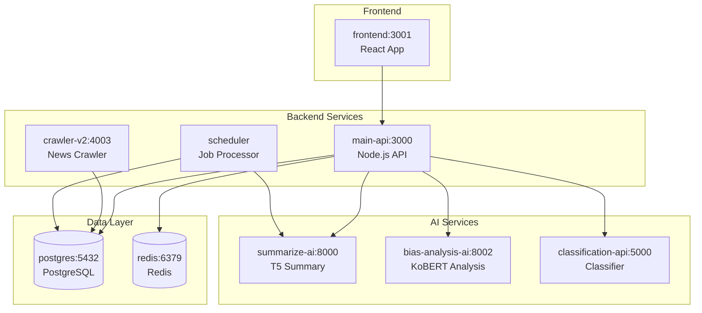
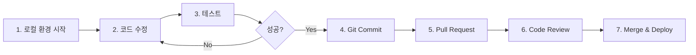

# FANS 프로젝트 시작가이드

**버전**: 2.0 (경량 아키텍처)
**작성일**: 2025-10-29
**대상**: 신규 팀원, 외부 개발자

---

## 목차

1. [프로젝트 소개](#프로젝트-소개)
2. [5분 빠른 시작](#5분-빠른-시작)
3. [로컬 개발 환경 구축](#로컬-개발-환경-구축)
4. [기본 사용법](#기본-사용법)
5. [다음 단계](#다음-단계)
6. [문제 해결](#문제-해결)

---

## 프로젝트 소개

### FANS란?

**FANS (Financial & Analytics News Service)**는 AI 기반 뉴스 큐레이션 및 편향성 분석 플랫폼입니다.


### 핵심 가치 및 주요 기능

- **자동 뉴스 수집**: 3분마다 Daum, Naver에서 자동 크롤링 (일 19,200개 → 중복 제거 후 5,000개)
- **AI 자동 요약**: T5 모델 기반 한국어 뉴스 3줄 요약 (평균 8초/기사)
- **편향성 분석**: KoBERT 기반 정치 성향 및 감성 분석
- **개인화 추천**: 사용자 행동 기반 뉴스 추천 알고리즘
- **소셜 로그인**: 카카오, 네이버 OAuth 2.0 통합

### 프로젝트 배경

기존 뉴스 플랫폼의 문제점:
- 정보 과부하 (하루 수만 개 기사 발행)
- 언론사별 편향성 파악 어려움
- 비슷한 기사 중복 노출

**FANS의 해결책**:
- AI 기반 자동 요약으로 빠른 정보 습득
- 편향성 점수 시각화로 객관적 판단 지원
- 개인화 알고리즘으로 관심 뉴스 추천

---

## 5분 빠른 시작

### 사전 요구사항

```bash
# 1. Docker & Docker Compose 설치 확인
docker --version
# Docker version 24.0+ 필요

docker-compose --version
# Docker Compose version 2.20+ 필요

# 2. Node.js 설치 확인 (프론트엔드 로컬 실행용)
node --version
# v18.0.0 이상 필요

# 3. Git 설치 확인
git --version
```

**설치 링크**:
- Docker Desktop: https://www.docker.com/products/docker-desktop
- Node.js: https://nodejs.org/ (LTS 버전 권장)

### 클론 및 환경 설정

```bash
# 1. 저장소 클론
git clone https://github.com/poungkee/my_fans.git
cd my_fans

# 2. 환경 변수 파일 생성
cp .env.example .env.local

# 3. 필수 환경 변수 수정 (아래 참고)
# Windows: notepad .env.local
# macOS/Linux: nano .env.local
```

**최소 설정** (.env.local에서 변경 필요):
```env
# 데이터베이스 비밀번호 (강력한 비밀번호로 변경)
POSTGRES_PASSWORD=your_strong_password_here

# JWT 시크릿 (랜덤 문자열 64자 이상)
JWT_SECRET=your_random_secret_key_minimum_64_characters_long

# 나머지는 기본값 유지 가능 (OAuth는 나중에 설정)
```

### Docker Compose 실행

```bash
# 1. 환경 파일 복사
cd environments/local
cp ../../.env.local .env

# 2. Docker Compose 시작 (백엔드 서비스들)
docker-compose up -d

# 3. 로그 확인
docker-compose logs -f

# 서비스가 모두 시작될 때까지 약 1-2분 소요
# "Server is running on port 3000" 메시지 확인
```

### 프론트엔드 로컬 실행 (권장)

```bash
# 새 터미널 열기
cd D:\dev1\frontend

# 의존성 설치 (최초 1회)
npm install

# 개발 서버 시작
PORT=3001 npm start

# 브라우저 자동 실행: http://localhost:3001
```

### 접속 확인

| 서비스 | URL | 설명 |
|--------|-----|------|
| **프론트엔드** | http://localhost:3001 | React 앱 |
| **백엔드 API** | http://localhost:3000 | Node.js API 서버 |
| **API 문서** | http://localhost:3000/api-docs | Swagger UI |
| **Health Check** | http://localhost:3000/health | 서버 상태 확인 |
| **AI 요약 API** | http://localhost:8000/health | T5 요약 서비스 |
| **편향 분석 API** | http://localhost:8002/health | KoBERT 분석 서비스 |

**성공 확인**:
```bash
# API 헬스체크
curl http://localhost:3000/health
# 응답: {"status":"ok","timestamp":"2025-10-29T..."}

# 뉴스 목록 조회
curl http://localhost:3000/api/news
# 응답: [{"id":1,"title":"..."}]
```

---

## 로컬 개발 환경 구축

### 환경 변수 설정

#### .env 파일 생성

```bash
# 프로젝트 루트에서
cp .env.example .env.local

# environments/local 폴더에 복사
cp .env.local environments/local/.env
```

#### 필수 환경 변수 설명

**데이터베이스 설정**:
```env
# PostgreSQL 연결 정보
DB_HOST=postgres              # Docker Compose 서비스명 (로컬)
DB_PORT=5432
DB_USERNAME=fans_user
DB_PASSWORD=CHANGE_THIS       # ⚠️ 반드시 변경
DB_NAME=fans_db

# PostgreSQL 초기화
POSTGRES_DB=fans_db
POSTGRES_USER=fans_user
POSTGRES_PASSWORD=CHANGE_THIS # ⚠️ DB_PASSWORD와 동일하게
```

**보안 설정**:
```env
# JWT 토큰 암호화 키 (64자 이상 랜덤 문자열)
JWT_SECRET=CHANGE_THIS_TO_STRONG_RANDOM_STRING

# 세션 시크릿
SESSION_SECRET=CHANGE_THIS_TO_STRONG_RANDOM_STRING
```

**AI 서비스 설정** (기본값 유지):
```env
# Docker Compose 서비스명 사용
AI_SERVICE_URL=http://summarize-ai:8000
BIAS_AI_URL=http://bias-analysis-ai:8002
CLASSIFICATION_API_URL=http://classification-api:5000
```

**크롤러 설정**:
```env
# 자동 크롤링 활성화
AUTO_CRAWL=true
CRAWL_INTERVAL=180000         # 3분 (밀리초)
CRAWL_LIMIT_PER_CATEGORY=20   # 카테고리당 수집 개수

# 크롤러 포트 (중요!)
API_CRAWLER_PORT=4003         # ⚠️ 4005 아님!
```

#### OAuth 키 설정 (Kakao, Naver)

**1. 카카오 로그인 설정**:

1. [Kakao Developers](https://developers.kakao.com/) 접속
2. 애플리케이션 추가 > REST API 키 복사
3. 제품 설정 > 카카오 로그인 > Redirect URI 등록:
   - `http://localhost:3000/api/auth/kakao/callback`

```env
KAKAO_CLIENT_ID=your_kakao_rest_api_key
KAKAO_CLIENT_SECRET=your_kakao_client_secret  # Admin 키
KAKAO_REDIRECT_URI=http://localhost:3000/api/auth/kakao/callback
```

**2. 네이버 로그인 설정**:

1. [Naver Developers](https://developers.naver.com/) 접속
2. 애플리케이션 등록 > 오픈 API 이용신청
3. 로그인 오픈 API > Callback URL 설정:
   - `http://localhost:3000/api/auth/naver/callback`

```env
NAVER_CLIENT_ID=your_naver_client_id
NAVER_CLIENT_SECRET=your_naver_client_secret
NAVER_REDIRECT_URI=http://localhost:3000/api/auth/naver/callback
```

**3. Naver 뉴스 검색 API** (선택사항):

```env
# Naver 검색 API (크롤링 보조)
NAVER_SEARCH_CLIENT_ID=your_naver_search_client_id
NAVER_SEARCH_CLIENT_SECRET=your_naver_search_client_secret
```

> **팁**: OAuth 키는 팀장에게 문의하거나, 개인 계정으로 발급 가능

### Docker Compose 실행

#### 전체 서비스 시작

```bash
# environments/local 폴더로 이동
cd D:\dev1\environments\local

# 모든 서비스 시작 (detached 모드)
docker-compose up -d

# 실시간 로그 확인
docker-compose logs -f

# 특정 서비스만 로그 확인
docker-compose logs -f main-api
```

**서비스 구성** (총 9개):



**9개 서비스**:
1. **frontend** - React 프론트엔드 (3001)
2. **main-api** - Node.js API 서버 (3000)
3. **crawler-v2** - 통합 크롤러 (4003) ⚠️ 포트 확인!
4. **scheduler** - 뉴스 처리 스케줄러
5. **summarize-ai** - T5 요약 AI (8000)
6. **bias-analysis-ai** - KoBERT 편향 분석 (8002)
7. **classification-api** - 뉴스 분류 API (5000)
8. **postgres** - PostgreSQL 데이터베이스 (5432)
9. **redis** - Redis 캐시 (6379)

#### 개별 서비스 시작

```bash
# 데이터베이스만 시작
docker-compose up -d postgres redis

# AI 서비스만 시작
docker-compose up -d summarize-ai bias-analysis-ai

# 크롤러만 재시작
docker-compose restart crawler-v2
```

#### 로그 확인

```bash
# 전체 로그 (실시간)
docker-compose logs -f

# API 서버 로그만
docker-compose logs -f main-api

# 크롤러 로그만 (포트 4003)
docker-compose logs -f crawler-v2

# 최근 100줄만 확인
docker-compose logs --tail=100 main-api

# 에러 로그만 필터링
docker-compose logs main-api | grep ERROR
```

### 프론트엔드 로컬 실행 (권장)

**왜 로컬 실행?**
- Hot Reload 빠름 (코드 수정 시 즉시 반영)
- 디버깅 용이 (React DevTools 사용)
- 빌드 불필요 (Docker 이미지 재빌드 X)

#### 설치 및 실행

```bash
# 1. 프론트엔드 폴더로 이동
cd D:\dev1\frontend

# 2. 의존성 설치 (최초 1회)
npm install

# 3. 개발 서버 시작 (포트 3001)
PORT=3001 npm start

# 4. 브라우저 자동 실행
# http://localhost:3001
```

#### 환경 변수 확인

프론트엔드는 백엔드 API 주소를 환경 변수로 설정:

**D:\dev1\frontend\.env**:
```env
# 로컬 백엔드 API
REACT_APP_API_BASE=http://localhost:3000
REACT_APP_API_URL=http://localhost:3000/api

# AI 서비스 (프론트엔드에서 직접 호출 시)
REACT_APP_AI_SERVICE_URL=http://localhost:8000
```

#### 도커로 실행 (선택사항)

```bash
# Docker Compose로 프론트엔드도 실행
cd D:\dev1\environments\local
docker-compose up -d frontend

# 접속: http://localhost:3001
```

---

## 기본 사용법

### API 테스트

#### Health Check

```bash
# 백엔드 API 상태 확인
curl http://localhost:3000/health

# 응답 예시:
{
  "status": "ok",
  "timestamp": "2025-10-29T12:34:56.789Z",
  "uptime": 3600,
  "database": "connected"
}
```

#### 뉴스 목록 조회

```bash
# 최신 뉴스 20개 조회
curl http://localhost:3000/api/news?limit=20

# 특정 카테고리 뉴스 조회
curl http://localhost:3000/api/news?category=정치&limit=10

# 응답 예시:
[
  {
    "id": 1,
    "title": "뉴스 제목",
    "summary": "AI 생성 요약문...",
    "category": "정치",
    "sentiment": "neutral",
    "bias_score": 0.52,
    "published_at": "2025-10-29T10:00:00Z"
  }
]
```

#### 뉴스 상세 조회

```bash
# 특정 뉴스 상세 정보 + 편향성 분석
curl http://localhost:3000/api/news/1

# 응답 예시:
{
  "id": 1,
  "title": "뉴스 제목",
  "content": "전체 기사 내용...",
  "summary": "AI 생성 요약문",
  "category": "정치",
  "media": "조선일보",
  "sentiment": "positive",
  "bias_score": 0.68,
  "bias_analysis": {
    "political_leaning": "conservative",
    "confidence": 0.85,
    "keywords": ["정부", "정책", "성장"]
  }
}
```

### 소셜 로그인

#### 카카오 로그인 플로우

1. **프론트엔드에서 로그인 버튼 클릭**:
   ```javascript
   // 카카오 로그인 페이지로 리다이렉트
   window.location.href = 'http://localhost:3000/api/auth/kakao';
   ```

2. **사용자 인증 후 백엔드로 콜백**:
   - Kakao → `http://localhost:3000/api/auth/kakao/callback?code=...`

3. **백엔드에서 JWT 토큰 발급 후 프론트엔드로 리다이렉트**:
   - `http://localhost:3001?token=eyJhbGciOi...`

4. **프론트엔드에서 토큰 저장**:
   ```javascript
   const token = new URLSearchParams(window.location.search).get('token');
   localStorage.setItem('jwt_token', token);
   ```

#### 네이버 로그인

동일한 플로우:
```javascript
window.location.href = 'http://localhost:3000/api/auth/naver';
```

#### 인증 API 호출

```bash
# JWT 토큰 포함하여 API 호출
curl -H "Authorization: Bearer YOUR_JWT_TOKEN" \
  http://localhost:3000/api/user/profile

# 응답 예시:
{
  "id": 1,
  "email": "user@example.com",
  "username": "홍길동",
  "provider": "kakao",
  "created_at": "2025-10-29T12:00:00Z"
}
```

### 데이터베이스 확인

#### PostgreSQL 접속

```bash
# Docker 컨테이너 내부 접속
docker exec -it fans_postgres psql -U fans_user -d fans_db

# 또는 로컬 psql 사용
psql -h localhost -p 5432 -U fans_user -d fans_db
# 비밀번호: .env.local의 POSTGRES_PASSWORD
```

#### development 스키마 확인

```sql
-- 현재 스키마 확인
SHOW search_path;
-- 출력: development, public

-- 스키마 전환
SET search_path TO development;

-- 테이블 목록 확인
\dt

-- 주요 테이블:
-- news_articles        (뉴스 기사)
-- raw_news             (크롤링 원본)
-- users                (사용자)
-- user_preferences     (사용자 선호도)
-- news_summaries       (AI 요약)
-- bias_analyses        (편향성 분석)
```

#### 초기 데이터 확인

```sql
-- 뉴스 개수 확인
SELECT COUNT(*) FROM development.news_articles;

-- 최신 뉴스 10개
SELECT id, title, category, published_at
FROM development.news_articles
ORDER BY published_at DESC
LIMIT 10;

-- 카테고리별 뉴스 개수
SELECT category, COUNT(*) as count
FROM development.news_articles
GROUP BY category
ORDER BY count DESC;

-- AI 요약된 뉴스 확인
SELECT na.title, ns.summary
FROM development.news_articles na
JOIN development.news_summaries ns ON na.id = ns.article_id
LIMIT 5;
```

#### 스키마 구조 확인

```sql
-- 테이블 상세 정보
\d+ development.news_articles

-- 컬럼 목록
SELECT column_name, data_type, is_nullable
FROM information_schema.columns
WHERE table_schema = 'development'
  AND table_name = 'news_articles';

-- 인덱스 확인
SELECT indexname, indexdef
FROM pg_indexes
WHERE schemaname = 'development'
  AND tablename = 'news_articles';
```

---

## 다음 단계

### 추가 학습 문서

1. **시스템 아키텍처 이해하기**:
   - [D:\dev1\docs\02_프로젝트_아키텍처_설명서.md](D:\dev1\docs\02_프로젝트_아키텍처_설명서.md) - 전체 시스템 구조
   - 마이크로서비스 구성
   - 데이터 흐름도
   - 기술 스택 상세

2. **개발 가이드**:
   - [D:\dev1\docs\03_설치_및_환경_구성_가이드.md](D:\dev1\docs\03_설치_및_환경_구성_가이드.md) - 고급 설정
   - [D:\dev1\docs\06_소스코드_상세_리뷰.md](D:\dev1\docs\06_소스코드_상세_리뷰.md) - 코드 구조
   - API 명세서 (Swagger UI: http://localhost:3000/api-docs)

3. **배포 가이드**:
   - [D:\dev1\docs\01_EKS_운영_가이드.md](D:\dev1\docs\01_EKS_운영_가이드.md) - AWS EKS 배포
   - [D:\dev1\docs\ECS_MIGRATION_ENV_GUIDE.md](D:\dev1\docs\ECS_MIGRATION_ENV_GUIDE.md) - ECS 환경
   - [D:\dev1\docs\MULTI_ENV_STRATEGY.md](D:\dev1\docs\MULTI_ENV_STRATEGY.md) - 멀티 환경 전략

4. **데이터베이스**:
   - [D:\dev1\docs\final_database_structure.sql](D:\dev1\docs\final_database_structure.sql) - 전체 스키마
   - [D:\dev1\docs\DB_구조_비교분석_상세.md](D:\dev1\docs\DB_구조_비교분석_상세.md) - 스키마 분석

### 개발 환경 커스터마이징

#### VS Code 추천 확장

1. **ESLint**: 코드 스타일 검사
2. **Prettier**: 코드 자동 포맷팅
3. **Docker**: Docker 파일 지원
4. **Thunder Client**: API 테스트 (Postman 대체)
5. **PostgreSQL**: SQL 쿼리 실행

#### Makefile 활용 (편의 명령어)

```bash
# 로컬 환경 시작
make start-local

# 현재 환경 확인
make current-env

# 로그 확인
make logs
make logs-api
make logs-crawler

# 재시작
make restart

# 중지
make stop

# 완전 정리 (볼륨 삭제)
make clean

# 도움말
make help
```

### 개발 워크플로우



### 기여하기

**협업 규칙**:

1. **데이터베이스 Entity 수정 금지**:
   - `D:\dev1\backend\api\src\entities\` 폴더
   - 팀원들과 이미 동기화된 상태
   - 필요 시 팀 회의 후 수정

2. **환경 파일 커밋 금지**:
   - `.env`, `.env.local`, `.env.ecs`, `.env.eks` 절대 커밋 X
   - `.gitignore`에 이미 포함됨

3. **주석 처리된 코드 삭제 금지**:
   - Spark, Kafka, Airflow 관련 주석 보존 (롤백 대비)

4. **브랜치 전략**:
   - `main`: 프로덕션
   - `develop`: 개발
   - `feature/*`: 기능 개발
   - `hotfix/*`: 긴급 수정

---

## 문제 해결

### Docker 실행 안됨

**증상**: `docker-compose up -d` 실패

**해결 방법**:

1. **Docker Desktop 실행 확인**:
   ```bash
   docker ps
   # 오류 발생 시 Docker Desktop 실행
   ```

2. **Docker Compose 버전 확인**:
   ```bash
   docker-compose --version
   # 2.20.0 이상 필요

   # 업그레이드 (Windows/Mac)
   # Docker Desktop 업데이트

   # Linux
   sudo apt update && sudo apt install docker-compose-plugin
   ```

3. **이전 컨테이너 정리**:
   ```bash
   cd D:\dev1\environments\local
   docker-compose down -v
   docker-compose up -d
   ```

4. **디스크 공간 확인**:
   ```bash
   docker system df

   # 미사용 이미지/컨테이너 정리
   docker system prune -a --volumes
   ```

### 포트 충돌

**증상**: `Bind for 0.0.0.0:3000 failed: port is already allocated`

**해결 방법**:

1. **사용 중인 프로세스 확인 (Windows)**:
   ```bash
   netstat -ano | findstr :3000
   # 출력: TCP 0.0.0.0:3000 0.0.0.0:0 LISTENING 12345

   # PID로 프로세스 확인
   tasklist | findstr 12345

   # 프로세스 종료
   taskkill /PID 12345 /F
   ```

2. **사용 중인 프로세스 확인 (macOS/Linux)**:
   ```bash
   lsof -i :3000
   # 출력: node 12345 user 23u IPv4 0x... 0t0 TCP *:3000 (LISTEN)

   # 프로세스 종료
   kill -9 12345
   ```

3. **포트 변경 (임시)**:
   ```bash
   # .env 파일 수정
   PORT=3333

   # 재시작
   docker-compose up -d
   ```

### DB 연결 실패

**증상**: `Error: connect ECONNREFUSED 127.0.0.1:5432`

**해결 방법**:

1. **PostgreSQL 컨테이너 상태 확인**:
   ```bash
   docker ps | grep postgres

   # 없으면 시작
   cd D:\dev1\environments\local
   docker-compose up -d postgres
   ```

2. **헬스 체크 확인**:
   ```bash
   docker-compose ps
   # postgres 상태가 "healthy"인지 확인

   # 로그 확인
   docker-compose logs postgres
   ```

3. **비밀번호 확인**:
   ```bash
   # .env 파일 확인
   cat .env | grep POSTGRES_PASSWORD

   # DB_PASSWORD와 POSTGRES_PASSWORD가 동일한지 확인
   cat .env | grep DB_PASSWORD
   ```

4. **직접 연결 테스트**:
   ```bash
   docker exec -it fans_postgres psql -U fans_user -d fans_db -c "SELECT 1;"
   # 출력: 1 (성공)
   ```

5. **초기화 스크립트 재실행**:
   ```bash
   # 볼륨 삭제 후 재시작
   docker-compose down -v
   docker-compose up -d postgres

   # 초기화 로그 확인
   docker-compose logs postgres | grep "database system is ready"
   ```

### OAuth 로그인 안됨

**증상**: 카카오/네이버 로그인 클릭 시 에러

**해결 방법**:

1. **환경 변수 확인**:
   ```bash
   cat .env | grep KAKAO
   cat .env | grep NAVER

   # YOUR_*로 시작하면 실제 값으로 변경 필요
   ```

2. **Redirect URI 확인**:
   - Kakao Developers: https://developers.kakao.com/
   - 내 애플리케이션 > 제품 설정 > 카카오 로그인 > Redirect URI
   - 등록된 URI: `http://localhost:3000/api/auth/kakao/callback`
   - `.env`의 `KAKAO_REDIRECT_URI`와 동일한지 확인

3. **백엔드 로그 확인**:
   ```bash
   docker-compose logs -f main-api | grep "OAuth"
   ```

4. **팀장에게 OAuth 키 요청**:
   - 개발용 공용 키 사용 가능
   - 또는 개인 계정으로 발급

### AI 서비스 응답 없음

**증상**: 요약/편향성 분석 안됨

**해결 방법**:

1. **AI 컨테이너 상태 확인**:
   ```bash
   docker ps | grep -E "summarize|bias"

   # 재시작
   docker-compose restart summarize-ai bias-analysis-ai
   ```

2. **헬스 체크**:
   ```bash
   curl http://localhost:8000/health
   curl http://localhost:8002/health

   # 응답 없으면 로그 확인
   docker-compose logs summarize-ai
   docker-compose logs bias-analysis-ai
   ```

3. **메모리 부족**:
   ```bash
   docker stats

   # AI 서비스가 메모리 90% 이상 사용 시
   # Docker Desktop > Settings > Resources > Memory 증가 (8GB → 16GB)
   ```

4. **모델 다운로드 대기**:
   ```bash
   # 최초 실행 시 Hugging Face에서 모델 다운로드 (1-2분 소요)
   docker-compose logs -f summarize-ai | grep "Model loaded"
   ```

### 크롤러 동작 안함

**증상**: 뉴스 데이터가 수집되지 않음

**해결 방법**:

1. **크롤러 컨테이너 확인**:
   ```bash
   docker ps | grep crawler

   # 로그 확인
   docker-compose logs -f crawler-v2
   ```

2. **자동 크롤링 설정 확인**:
   ```bash
   cat .env | grep AUTO_CRAWL
   # AUTO_CRAWL=true 인지 확인
   ```

3. **수동 크롤링 테스트**:
   ```bash
   # ⚠️ 포트 4003 사용 (4005 아님!)
   curl -X POST http://localhost:4003/api/crawl

   # 응답:
   {"status":"success","message":"Crawling started"}
   ```

4. **DB에 데이터 확인**:
   ```sql
   -- raw_news 테이블 확인
   SELECT COUNT(*) FROM development.raw_news;

   -- 최신 크롤링 데이터
   SELECT title, created_at FROM development.raw_news
   ORDER BY created_at DESC LIMIT 5;
   ```

### 프론트엔드 빌드 실패

**증상**: `npm start` 또는 `npm run build` 실패

**해결 방법**:

1. **Node.js 버전 확인**:
   ```bash
   node --version
   # v18.0.0 이상 필요

   # nvm 사용 시
   nvm install 18
   nvm use 18
   ```

2. **node_modules 재설치**:
   ```bash
   cd D:\dev1\frontend
   rm -rf node_modules package-lock.json
   npm install
   ```

3. **캐시 삭제**:
   ```bash
   npm cache clean --force
   npm install
   ```

4. **환경 변수 확인**:
   ```bash
   cat frontend/.env
   # REACT_APP_API_BASE가 올바른지 확인
   ```

### 추가 지원

**문서**:
- 전체 문서 목록: [D:\dev1\docs\README.md](D:\dev1\docs\README.md)
- FAQ: [D:\dev1\docs\FAQ.md](D:\dev1\docs\FAQ.md) (있는 경우)

**커뮤니티**:
- GitHub Issues: 버그 리포트 및 기능 제안
- Slack: #fans-dev 채널 (팀원용)
- Email: fans-support@example.com

**긴급 상황**:
- 프로덕션 장애 시 팀장 연락
- 보안 취약점 발견 시 즉시 보고

---

## 부록

### 시스템 요구사항

| 항목 | 최소 사양 | 권장 사양 |
|------|----------|----------|
| CPU | 2 cores | 4 cores |
| RAM | 8 GB | 16 GB |
| 디스크 | 20 GB | 50 GB (SSD) |
| OS | Windows 10, macOS 12, Ubuntu 20.04 | Windows 11, macOS 14, Ubuntu 22.04 |
| Docker | 4.0+ | 최신 버전 |

### 포트 맵

| 포트 | 서비스 | 설명 |
|------|--------|------|
| 3000 | main-api | 백엔드 API 서버 |
| 3001 | frontend | React 프론트엔드 |
| **4003** | **crawler-v2** | **통합 크롤러 (Daum, Naver)** ⚠️ |
| 5000 | classification-api | 뉴스 분류 API |
| 5432 | postgres | PostgreSQL 데이터베이스 |
| 6379 | redis | Redis 캐시 |
| 8000 | summarize-ai | T5 요약 AI |
| 8002 | bias-analysis-ai | KoBERT 편향 분석 AI |

### 주요 디렉토리 구조

```
D:\dev1
├── backend/
│   ├── api/                    # Main API (Node.js + TypeORM)
│   │   ├── src/
│   │   │   ├── entities/       # DB Entity (⚠️ 수정 금지)
│   │   │   ├── controllers/    # API 컨트롤러
│   │   │   ├── services/       # 비즈니스 로직
│   │   │   └── routes/         # 라우팅
│   │   └── Dockerfile
│   ├── crawler/
│   │   └── crawler-v2/         # 통합 크롤러 (TypeScript)
│   ├── ai/
│   │   ├── summarize-ai/       # T5 요약 (Python + FastAPI)
│   │   └── bias-analysis-ai/   # KoBERT 분석 (Python + FastAPI)
│   ├── scheduler/              # 작업 스케줄러 (Node.js)
│   ├── simple-classifier/      # 분류 API (Python + Flask)
│   └── database/
│       └── init.sql            # DB 초기화 스크립트
├── frontend/                   # React 앱
│   ├── src/
│   │   ├── components/         # React 컴포넌트
│   │   ├── pages/              # 페이지
│   │   └── services/           # API 호출
│   └── package.json
├── environments/
│   ├── local/                  # 로컬 환경
│   │   ├── docker-compose.yml  # Docker Compose 설정
│   │   └── .env                # 로컬 환경 변수
│   ├── ecs/                    # AWS ECS 환경
│   └── eks/                    # AWS EKS 환경
├── docs/                       # 문서 모음
│   ├── 01_프로젝트_시작가이드.md  # 이 문서
│   ├── 02_프로젝트_아키텍처_설명서.md
│   └── ...
├── scripts/                    # 유틸리티 스크립트
│   ├── switch-env.sh           # 환경 전환
│   └── docker-start.sh         # Docker 시작
├── .env.example                # 환경 변수 템플릿
├── .gitignore
├── CLAUDE.md                   # 프로젝트 메모리
├── MIGRATION.md                # 아키텍처 변경 내역
└── README.md
```

### 아키텍처 히스토리

**v2.0 (2025-10-16) - 경량화**:
- ❌ 제거: Spark, Kafka, Airflow
- ✅ 추가: Node.js Scheduler, 통합 크롤러
- 📉 메모리 사용량: 32GB → 8GB (75% 절감)

**v1.0 (2025-09-01) - 초기 버전**:
- Apache Spark (데이터 처리)
- Apache Kafka (메시지 큐)
- Apache Airflow (워크플로우)

> **참고**: 주석 처리된 Spark/Kafka/Airflow 코드는 롤백 대비용으로 보존

### DB 스키마 정보

**스키마 분리**:
- `development`: 개발 환경 (로컬)
- `production`: 프로덕션 환경 (ECS/EKS)

**주요 테이블**:
- `news_articles`: 최종 뉴스 기사
- `raw_news`: 크롤링 원본 데이터
- `users`: 사용자 정보
- `news_summaries`: AI 요약 결과
- `bias_analyses`: 편향성 분석 결과

---

**작성자**: FANS 개발팀
**최종 업데이트**: 2025-10-29
**문서 버전**: 2.0

**다음 문서**: [02_프로젝트_아키텍처_설명서.md](D:\dev1\docs\02_프로젝트_아키텍처_설명서.md)
