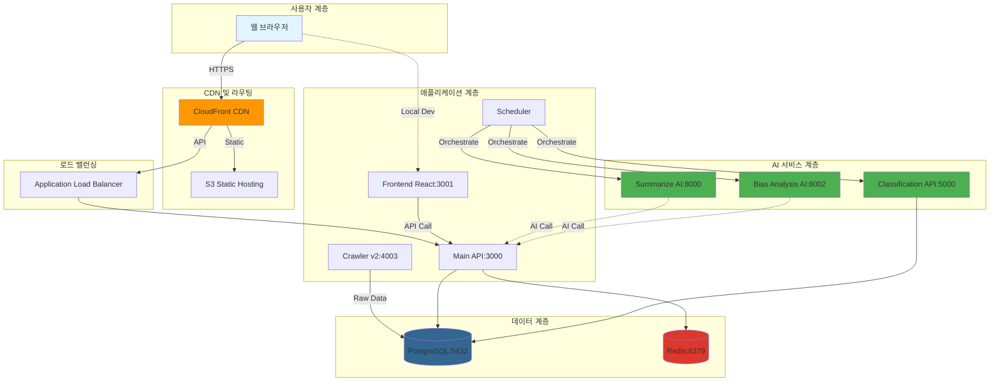
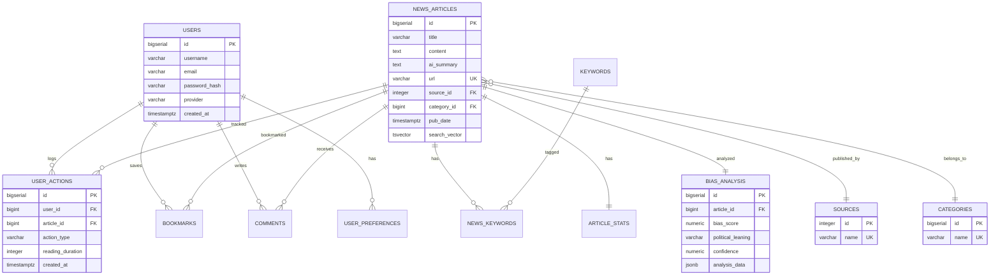
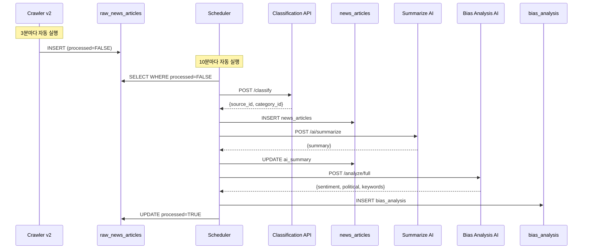
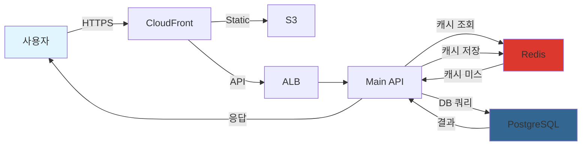
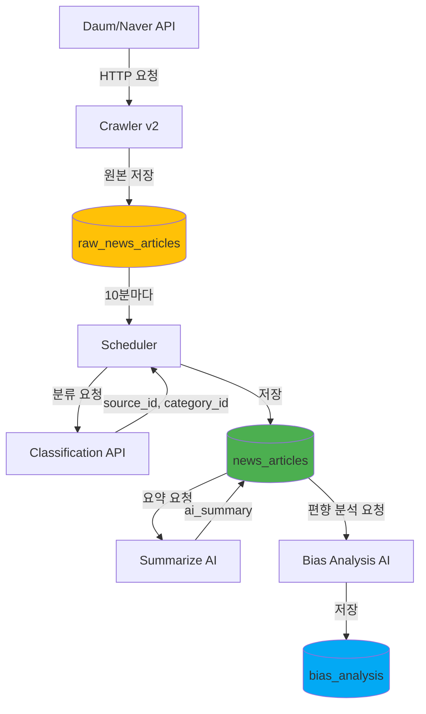

# FANS 시스템 아키텍처

**Financial & Analytics News Service**
**작성일**: 2025-10-29
**버전**: 2.1 (Architecture v2.0)

---

## 목차

1. [전체 시스템 개요](#전체-시스템-개요)
2. [아키텍처 원칙](#아키텍처-원칙)
3. [기술 스택](#기술-스택)
4. [마이크로서비스 구성](#마이크로서비스-구성)
5. [데이터베이스 설계](#데이터베이스-설계)
6. [크롤링 및 AI 파이프라인](#크롤링-및-ai-파이프라인)
7. [데이터 흐름도](#데이터-흐름도)
8. [보안 아키텍처](#보안-아키텍처)
9. [성능 최적화](#성능-최적화)
10. [배포 아키텍처](#배포-아키텍처)

---

## 전체 시스템 개요

### 시스템 구성도



### 시스템 흐름 설명

```
┌─────────────────────────────────────────────────────────────────────┐
│ 1. 뉴스 수집 단계 (3분마다)                                          │
└───────────┬─────────────────────────────────────────────────────────┘
            │
    ┌───────▼────────┐
    │  Crawler v2    │ (Daum News + Naver News API)
    │   Port 4003    │
    └───────┬────────┘
            │
            ▼
    ┌──────────────────────┐
    │ raw_news_articles    │ (원본 저장, processed=FALSE)
    └───────┬──────────────┘
            │
┌───────────▼──────────────────────────────────────────────────────────┐
│ 2. AI 처리 단계 (10분마다)                                            │
└──────────────────────────────────────────────────────────────────────┘
            │
            ├─► [1] Classification API → 카테고리/언론사 분류
            ├─► [2] Summarize AI → 3문장 요약 생성
            ├─► [3] Keyword Extraction → 형태소 분석
            └─► [4] Bias Analysis AI → 편향성 분석
            │
            ▼
    ┌──────────────────┐
    │  news_articles   │ (최종 데이터 + AI 요약 + 편향 분석)
    └───────┬──────────┘
            │
┌───────────▼──────────────────────────────────────────────────────────┐
│ 3. 사용자 서비스 단계                                                 │
└──────────────────────────────────────────────────────────────────────┘
            │
            ├─► Redis 캐싱 (응답 속도 <100ms)
            ├─► 뉴스 피드 API
            ├─► 전문 검색 (Full-Text Search)
            └─► 편향성 시각화
```

---

## 아키텍처 원칙

### 2025-10-16 아키텍처 변경 (v2.0)

#### 변경 전 (v1.0)
```
Apache Spark + Kafka + Airflow
└─> 대용량 데이터 처리 중심 설계
    - 메모리 사용량: 16GB+
    - 복잡한 인프라 관리
    - 높은 운영 비용
```

#### 변경 후 (v2.0) - 현재
```
Node.js + Python + PostgreSQL + Redis
└─> 경량화 및 단순화 설계
    - 메모리 사용량: 4GB (75% 절감)
    - 간소화된 인프라
    - 비용 효율적
    - Spark/Kafka/Airflow 주석 처리 (롤백 대비)
```

### 핵심 설계 원칙

1. **마이크로서비스 아키텍처**
   - 서비스별 독립적 개발/배포/확장
   - 9개 독립 서비스 (Frontend, API, Crawler, Scheduler, 3 AI Services, DB, Cache)
   - Docker 컨테이너 기반 격리

2. **경량화 및 효율성**
   - 대용량 처리 도구 제거 (Spark, Kafka, Airflow)
   - Node.js 스케줄러(node-cron)로 작업 자동화
   - PostgreSQL 스키마 분리로 개발/운영 환경 독립

3. **확장성 및 유연성**
   - 수평 확장 가능한 구조
   - Auto-scaling 지원 (ECS/EKS)
   - Stateless 설계 (세션 정보는 Redis)

4. **보안 우선**
   - JWT 인증 + OAuth 2.0
   - 환경 변수 기반 설정
   - DB 스키마 권한 분리 (development/production)
   - Private Subnet 배치

5. **관측 가능성 (Observability)**
   - CloudWatch 로그 집중화
   - Prometheus + Grafana 모니터링
   - 헬스 체크 엔드포인트
   - 메트릭 수집 및 알림

---

## 기술 스택

### Frontend (프론트엔드)

| 카테고리 | 기술 | 버전 | 용도 |
|---------|------|------|------|
| **UI 프레임워크** | React | 18.2.0 | SPA 구현 |
| **라우팅** | React Router | 6.x | 페이지 라우팅 |
| **HTTP 클라이언트** | Axios | 1.x | REST API 통신 |
| **스타일링** | CSS3 | - | 반응형 디자인 |
| **상태 관리** | React Hooks | - | 컴포넌트 상태 관리 |
| **빌드 도구** | React Scripts | 5.0.1 | CRA 기반 빌드 |

**주요 특징**:
- Single Page Application (SPA)
- 로컬 개발 권장 (포트 3001)
- 프로덕션: S3 + CloudFront 배포

---

### Backend (백엔드)

#### Main API Server

| 카테고리 | 기술 | 버전 | 용도 |
|---------|------|------|------|
| **런타임** | Node.js | 18+ | JavaScript 서버 |
| **언어** | TypeScript | 5.x | 타입 안전성 |
| **프레임워크** | Express.js | 4.18.2 | RESTful API |
| **ORM** | TypeORM | 0.3.17 | PostgreSQL 매핑 |
| **인증** | JWT | - | 토큰 기반 인증 |
| **OAuth** | Passport.js | - | 소셜 로그인 (카카오, 네이버) |
| **암호화** | bcrypt | 5.1.1 | 비밀번호 해싱 |
| **캐싱** | Redis Client | 4.x | 캐시 연결 |
| **파일 업로드** | Multer | 2.0.2 | 이미지 처리 |

**포트**: 3000

**주요 기능**:
- 뉴스 CRUD API
- 사용자 인증/인가
- 북마크, 댓글, 좋아요
- AI 서비스 오케스트레이션
- 실시간 추천

---

#### Crawler Service (v2)

| 카테고리 | 기술 | 버전 | 용도 |
|---------|------|------|------|
| **런타임** | Node.js + TypeScript | 18+ | 크롤러 실행 |
| **HTTP 클라이언트** | Axios | 1.x | HTTP 요청 |
| **HTML 파싱** | Cheerio | 1.1.2 | DOM 파싱 |
| **인코딩** | iconv-lite | - | EUC-KR 변환 |
| **스케줄러** | 환경변수 (자동 실행) | - | 3분마다 자동 크롤링 |

**포트**: 4003

**크롤링 소스**:
- Daum News (8개 카테고리)
- Naver News API (검색 보조)

**수집 통계**:
- 크롤링 주기: 3분
- 시간당: 약 800개
- 일일: 약 19,200개 (중복 제거 후 ~5,000개)

---

#### Scheduler Service

| 카테고리 | 기술 | 버전 | 용도 |
|---------|------|------|------|
| **런타임** | Node.js + TypeScript | 18+ | 스케줄러 |
| **스케줄러** | node-cron | 3.x | Cron 작업 |
| **DB 클라이언트** | pg (node-postgres) | 8.x | PostgreSQL 연결 |

**대체 서비스**: Airflow → node-cron

**작업 스케줄**: 10분마다 (`*/10 * * * *`)

**주요 작업**:
1. Raw 뉴스 처리 (분류 및 이동)
2. AI 요약 생성
3. 키워드 추출
4. 편향성 분석

---

### AI/ML Services (인공지능)

#### 1. Summarize AI (요약 서비스)

| 카테고리 | 기술 | 용도 |
|---------|------|------|
| **언어** | Python 3.10 | - |
| **프레임워크** | FastAPI | 고성능 비동기 API |
| **ML 라이브러리** | Transformers (Hugging Face) | 모델 로드 |
| **모델** | eenzeenee/t5-base-korean-summarization | 한국어 요약 |
| **추론 엔진** | PyTorch | 딥러닝 추론 |

**포트**: 8000

**기능**:
- 뉴스 기사 3문장 요약
- 최대 100자 요약 (설정 가능)
- 배치 처리 지원

---

#### 2. Bias Analysis AI (편향성 분석)

| 카테고리 | 기술 | 용도 |
|---------|------|------|
| **언어** | Python 3.10 | - |
| **프레임워크** | FastAPI | 고성능 비동기 API |
| **ML 라이브러리** | Transformers | 모델 로드 |
| **모델** | KoBERT (monologg) | 감성 분석 |
| **형태소 분석** | KoNLPy (Okt) | 키워드 추출 |

**포트**: 8002

**기능**:
- 감성 분석 (긍정/부정/중립)
- 정치 성향 분석 (진보/중도/보수)
- 키워드 추출 (상위 10개)
- 편향 점수 계산 (-1.0 ~ +1.0)

**분석 모듈**:
- `sentiment_analyzer.py`: 감성 분석
- `keyword_extractor.py`: 키워드 추출
- `political_analyzer.py`: 정치 성향 분석

---

#### 3. Classification API (분류 서비스)

| 카테고리 | 기술 | 용도 |
|---------|------|------|
| **언어** | Python 3.10 | - |
| **프레임워크** | Flask + Gunicorn | 웹 서버 |
| **ML 라이브러리** | scikit-learn | 머신러닝 |
| **모델** | Random Forest | 분류 알고리즘 |
| **벡터화** | TF-IDF | 텍스트 벡터화 |

**포트**: 5000

**기능**:
- 뉴스 카테고리 자동 분류 (8개)
- 언론사 자동 매핑 (15개)
- 정확도: 85~90%

**언론사 목록**:
- 연합뉴스, 조선일보, 중앙일보, 동아일보
- 한겨레, 경향신문, 한국일보
- 매일경제, 한국경제, 머니투데이
- YTN, JTBC, 문화일보, 세계일보, 기타

---

### Database (데이터베이스)

#### PostgreSQL

| 카테고리 | 기술 | 버전 | 용도 |
|---------|------|------|------|
| **RDBMS** | PostgreSQL | 15+ | 메인 데이터베이스 |
| **확장** | pg_trgm | - | 전문 검색 최적화 |
| **확장** | uuid-ossp | - | UUID 생성 |
| **스키마 분리** | development / production | - | 환경 독립성 |

**포트**: 5432

**주요 특징**:
- 트랜잭션 ACID 보장
- 전문 검색 (Full-Text Search)
- JSONB 데이터 타입 (편향성 분석 저장)
- 스키마 기반 환경 분리 (2025-10-29 구현)

**스키마 구조**:
```sql
PostgreSQL (fans_db)
├── development 스키마 (개발 환경)
│   ├── 21개 테이블
│   ├── 30+ 인덱스
│   ├── 8개 트리거
│   └── 모든 권한 (DDL 포함)
│
├── production 스키마 (운영 환경)
│   ├── 21개 테이블 (동일 구조)
│   ├── 30+ 인덱스
│   ├── 8개 트리거
│   └── 제한된 권한 (DML만)
│
└── public 스키마 (호환성 유지)
```

**환경 변수 기반 자동 전환**:
```typescript
// TypeORM 설정
{
  schema: process.env.DB_SCHEMA,  // 'development' or 'production'
  // ...
}
```

---

#### Redis

| 카테고리 | 기술 | 버전 | 용도 |
|---------|------|------|------|
| **캐시** | Redis | 7 | 인메모리 캐싱 |
| **데이터 구조** | String, Hash, List, Set | - | 다양한 캐시 타입 |

**포트**: 6379

**주요 기능**:
- API 응답 캐싱 (TTL: 5분)
- 세션 저장
- 인기 뉴스 리스트 캐싱
- 캐시 히트율: 70%+

---

### DevOps & Infrastructure (배포)

| 카테고리 | 기술 | 용도 |
|---------|------|------|
| **컨테이너** | Docker 24+ | 애플리케이션 컨테이너화 |
| **오케스트레이션** | Docker Compose 2+ | 로컬 개발 환경 |
| **Kubernetes** | Amazon EKS (v1.31) | 프로덕션 컨테이너 관리 |
| **클라우드** | AWS | 인프라 호스팅 |
| **IaC** | Terraform 1.6+ | 인프라 코드화 |
| **로드밸런서** | Application Load Balancer (ALB) | L7 로드밸런싱 |
| **CDN** | CloudFront | 정적 콘텐츠 배포 |
| **DNS** | Route 53 | 도메인 관리 |
| **레지스트리** | Amazon ECR | Docker 이미지 저장 |
| **CI/CD** | GitHub Actions | 자동 배포 파이프라인 |
| **모니터링** | Prometheus + Grafana | 메트릭 수집 및 시각화 |
| **로그** | CloudWatch Logs | 중앙 집중식 로깅 |
| **알림** | Alertmanager | 장애 알림 |

---

## 마이크로서비스 구성

### 서비스 목록

| # | 서비스명 | 포트 | 언어/프레임워크 | 역할 | 레플리카 (EKS) |
|---|---------|------|---------------|------|---------------|
| 1 | **Frontend** | 3001 | React 18 | 사용자 UI | 2 |
| 2 | **Main API** | 3000 | Node.js 18 + Express | 핵심 비즈니스 로직 | 2 |
| 3 | **Crawler v2** | 4003 | Node.js 18 + TypeScript | 뉴스 수집 | 1 |
| 4 | **Scheduler** | - | Node.js 18 + node-cron | 작업 스케줄링 | 1 |
| 5 | **Summarize AI** | 8000 | Python 3.10 + FastAPI | 뉴스 요약 | 2 |
| 6 | **Bias Analysis AI** | 8002 | Python 3.10 + FastAPI | 편향 분석 | 2 |
| 7 | **Classification API** | 5000 | Python 3.10 + Flask | 카테고리 분류 | 2 |
| 8 | **PostgreSQL** | 5432 | PostgreSQL 15 | 데이터베이스 | 1 (Multi-AZ) |
| 9 | **Redis** | 6379 | Redis 7 | 캐싱 | 1 |

**총 Pod 수**: 14개 (레플리카 포함)

---

### 1. Frontend (React)

**역할**: 사용자 인터페이스 제공

**기술 스택**:
- React 18
- React Router 6
- Axios
- CSS3

**주요 기능**:
- 뉴스 피드 표시
- 카테고리/언론사 필터링
- 검색 기능
- 뉴스 상세 보기
- 편향성 시각화
- 사용자 인증 (로그인/회원가입)
- 북마크, 댓글, 좋아요

**배포 방식**:
- 로컬: `PORT=3001 npm start`
- 프로덕션: S3 + CloudFront

**환경 변수**:
```env
# 로컬
REACT_APP_API_URL=http://localhost:3000

# 프로덕션
REACT_APP_API_URL=https://api.fans.ai.kr
```

---

### 2. Main API (Node.js)

**역할**: 핵심 비즈니스 로직 처리

**기술 스택**:
- Node.js 18 + TypeScript
- Express.js
- TypeORM
- JWT + Passport.js

**주요 API**:
```
GET  /api/news/feed              # 뉴스 피드
GET  /api/news/:id               # 뉴스 상세
GET  /api/news/search            # 검색
POST /api/auth/login             # 로그인
POST /api/auth/register          # 회원가입
POST /api/bookmarks              # 북마크
POST /api/comments               # 댓글
POST /api/actions                # 사용자 행동 로그
GET  /health                     # 헬스 체크
```

**DB 연결**:
- PostgreSQL (TypeORM)
- 환경 변수로 스키마 자동 전환 (`DB_SCHEMA`)

**Redis 캐싱**:
- 뉴스 피드: TTL 5분
- 인기 뉴스: TTL 10분

---

### 3. Crawler v2 (통합 크롤러)

**역할**: 외부 뉴스 소스에서 데이터 수집

**기술 스택**:
- Node.js 18 + TypeScript
- Axios (HTTP 요청)
- Cheerio (HTML 파싱)

**크롤링 소스**:
1. **Daum News**:
   - URL: `https://news.daum.net`
   - 방식: JSON API
   - 카테고리: 8개 (정치, 경제, 사회, 생활/문화, 세계, IT/과학, 스포츠, 연예)

2. **Naver News**:
   - URL: `https://openapi.naver.com/v1/search/news.json`
   - 방식: REST API
   - 용도: 검색 보조

**자동 크롤링 설정**:
```env
AUTO_CRAWL=true
CRAWL_INTERVAL=180000           # 3분 (밀리초)
CRAWL_LIMIT_PER_CATEGORY=5
```

**저장 테이블**:
- `raw_news_articles` (processed=FALSE)

**API 엔드포인트**:
```
POST /crawl/daum                # Daum 크롤링
POST /crawl/naver               # Naver 크롤링
POST /crawl/all                 # 전체 크롤링
GET  /status                    # 크롤러 상태
GET  /health                    # 헬스 체크
```

---

### 4. Scheduler (작업 스케줄러)

**역할**: 주기적 작업 자동화 (Airflow 대체)

**기술 스택**:
- Node.js 18 + TypeScript
- node-cron (스케줄러)
- pg (PostgreSQL 클라이언트)

**스케줄**: 10분마다 (`*/10 * * * *`)

**작업 순서**:
```typescript
cron.schedule('*/10 * * * *', async () => {
  // 1. Raw 뉴스 처리 (0분)
  await processRawNews();          // → Classification API 호출

  // 2. AI 요약 생성 (1분 후)
  await generateSummaries();       // → Summarize AI 호출

  // 3. 키워드 추출 (2분 후)
  await extractKeywords();         // → 로컬 처리 (KoNLPy)

  // 4. 편향성 분석 (3분 후)
  await analyzeBias();             // → Bias Analysis AI 호출
});
```

**환경 변수**:
```env
SCHEDULE_INTERVAL=*/10 * * * *
RAW_NEWS_BATCH_SIZE=100
SUMMARY_BATCH_SIZE=50
LOG_LEVEL=info
```

---

### 5. Summarize AI (요약 AI)

**역할**: T5 모델 기반 뉴스 요약

**기술 스택**:
- Python 3.10
- FastAPI
- Transformers (Hugging Face)
- PyTorch

**모델**:
- `eenzeenee/t5-base-korean-summarization`
- 한국어 뉴스 요약 전문

**API 엔드포인트**:
```
POST /ai/summarize
  Body: {
    "text": "원본 기사 내용 (3000자 이내)",
    "max_length": 100
  }

  Response: {
    "summary": "AI 생성 요약 (3문장)",
    "length": 85,
    "model": "eenzeenee/t5-base-korean-summarization"
  }

GET /health
```

**처리 시간**: 평균 3초/기사

---

### 6. Bias Analysis AI (편향성 분석 AI)

**역할**: KoBERT 기반 감성 및 정치 성향 분석

**기술 스택**:
- Python 3.10
- FastAPI
- Transformers (KoBERT)
- KoNLPy (Okt)

**API 엔드포인트**:
```
POST /analyze/full
  Body: {
    "title": "기사 제목",
    "content": "기사 본문"
  }

  Response: {
    "sentiment": {
      "sentiment": "negative",
      "confidence": 0.85,
      "score": -0.65,
      "positive_count": 3,
      "negative_count": 15
    },
    "political": {
      "bias_score": 0.72,
      "stance": "left-leaning",
      "party_analysis": {
        "더불어민주당": 0.8,
        "국민의힘": 0.2
      }
    },
    "keywords": [
      {"word": "경제", "score": 0.95},
      {"word": "성장", "score": 0.82}
    ]
  }

POST /analyze/sentiment     # 감성 분석만
POST /analyze/keywords      # 키워드 추출만
POST /analyze/political     # 정치 분석만
GET  /health
```

**처리 시간**: 평균 2초/기사

---

### 7. Classification API (분류 API)

**역할**: Random Forest 기반 카테고리 및 언론사 분류

**기술 스택**:
- Python 3.10
- Flask + Gunicorn
- scikit-learn
- TF-IDF

**API 엔드포인트**:
```
POST /classify
  Body: {
    "title": "기사 제목",
    "content": "기사 본문",
    "original_source": "조선일보",
    "original_category": "정치"
  }

  Response: {
    "source_id": 23,
    "source_name": "조선일보",
    "category_id": 1,
    "category_name": "정치",
    "confidence": 0.92
  }

GET /health
```

**분류 정확도**: 85~90%

**처리 시간**: 평균 1초/기사

---

### 8. PostgreSQL (스키마 분리)

**역할**: 메인 데이터베이스

**환경 분리 전략** (2025-10-29 구현):
```sql
-- Development 스키마
CREATE SCHEMA development;
GRANT ALL PRIVILEGES ON SCHEMA development TO fans_user;

-- Production 스키마
CREATE SCHEMA production;
GRANT SELECT, INSERT, UPDATE, DELETE ON ALL TABLES IN SCHEMA production TO fans_user;
-- DDL 권한 제외 (보안 강화)
```

**스키마 자동 전환**:
```typescript
// backend/api/src/config/database.ts
export const dataSource = new DataSource({
  type: 'postgres',
  host: env.DB_HOST,
  port: env.DB_PORT,
  username: env.DB_USERNAME,
  password: env.DB_PASSWORD,
  database: env.DB_NAME,
  schema: env.DB_SCHEMA,        // ⭐ 환경 변수로 자동 전환
  entities: [__dirname + '/../entities/*.ts'],
  synchronize: false,           // 운영에서는 false
  logging: env.NODE_ENV === 'development',
});
```

**환경 변수**:
```env
# 로컬
DB_SCHEMA=development

# 프로덕션
DB_SCHEMA=production
```

**테이블 목록**: [데이터베이스 설계 참고](#데이터베이스-설계)

---

### 9. Redis (캐싱)

**역할**: 인메모리 캐싱

**주요 캐시 전략**:
```javascript
// 뉴스 피드 캐싱
const cacheKey = `news:feed:${topics}:${limit}:${sort}`;
const cached = await redis.get(cacheKey);
if (cached) return JSON.parse(cached);

const result = await db.query(/* ... */);
await redis.setex(cacheKey, 300, JSON.stringify(result));  // TTL 5분
```

**캐시 키 패턴**:
- `news:feed:{topics}:{limit}:{sort}`: 뉴스 피드
- `news:detail:{id}`: 뉴스 상세
- `news:trending`: 인기 뉴스 (TTL 10분)
- `user:session:{token}`: 세션 정보

**성능 개선**:
- 캐시 히트율: 70%+
- 응답 시간: <100ms (캐시 히트 시)

---

## 데이터베이스 설계

### 스키마 분리 전략 (2025-10-29)

#### Development 스키마
```sql
CREATE SCHEMA development;

-- 모든 테이블 생성
CREATE TABLE development.users (...);
CREATE TABLE development.news_articles (...);
-- ... (21개 테이블)

-- 모든 권한 부여
GRANT ALL PRIVILEGES ON SCHEMA development TO fans_user;
GRANT ALL PRIVILEGES ON ALL TABLES IN SCHEMA development TO fans_user;
GRANT ALL PRIVILEGES ON ALL SEQUENCES IN SCHEMA development TO fans_user;
```

#### Production 스키마
```sql
CREATE SCHEMA production;

-- 동일한 테이블 구조 생성
CREATE TABLE production.users (...);
CREATE TABLE production.news_articles (...);
-- ... (21개 테이블)

-- DML만 허용 (보안 강화)
GRANT USAGE ON SCHEMA production TO fans_user;
GRANT SELECT, INSERT, UPDATE, DELETE ON ALL TABLES IN SCHEMA production TO fans_user;
GRANT USAGE, SELECT ON ALL SEQUENCES IN SCHEMA production TO fans_user;
-- DDL 권한 제외 (CREATE, DROP, ALTER 불가)
```

---

### ERD (Entity Relationship Diagram)



---

### 주요 테이블 설명

#### 1. users (사용자)

```sql
CREATE TABLE users (
    id BIGSERIAL PRIMARY KEY,
    username VARCHAR(50) NOT NULL UNIQUE,
    email VARCHAR(100) NOT NULL UNIQUE,
    password_hash VARCHAR(255) NOT NULL,
    provider VARCHAR(20) DEFAULT 'local',   -- 'local', 'kakao', 'naver'
    social_token VARCHAR(500),
    profile_image VARCHAR(500),
    active BOOLEAN DEFAULT true,
    last_login TIMESTAMPTZ,
    created_at TIMESTAMPTZ DEFAULT NOW(),
    updated_at TIMESTAMPTZ DEFAULT NOW()
);

-- 인덱스
CREATE INDEX idx_users_email ON users(email);
CREATE INDEX idx_users_provider ON users(provider);
```

**설명**: 로컬 계정 및 소셜 로그인 통합 관리

---

#### 2. news_articles (뉴스 기사)

```sql
CREATE TABLE news_articles (
    id BIGSERIAL PRIMARY KEY,
    title VARCHAR(500) NOT NULL,
    content TEXT,
    ai_summary TEXT,                        -- AI 생성 요약
    url VARCHAR(1000) UNIQUE,
    image_url VARCHAR(1000),
    source_id INTEGER REFERENCES sources(id),
    category_id BIGINT REFERENCES categories(id),
    journalist VARCHAR(100),
    pub_date TIMESTAMPTZ,
    created_at TIMESTAMPTZ DEFAULT NOW(),
    updated_at TIMESTAMPTZ DEFAULT NOW(),
    search_vector tsvector                 -- 전문 검색용
);

-- 인덱스 (7개)
CREATE INDEX idx_news_source_id ON news_articles(source_id);
CREATE INDEX idx_news_category_id ON news_articles(category_id);
CREATE INDEX idx_news_pub_date ON news_articles(pub_date DESC);
CREATE INDEX idx_news_created_at ON news_articles(created_at DESC);
CREATE INDEX idx_news_search_vector ON news_articles USING GIN(search_vector);
CREATE INDEX idx_news_journalist ON news_articles(journalist) WHERE journalist IS NOT NULL;
```

**설명**: 최종 처리된 뉴스 기사 (AI 요약 포함)

---

#### 3. raw_news_articles (크롤링 원본)

```sql
CREATE TABLE raw_news_articles (
    id BIGSERIAL PRIMARY KEY,
    title VARCHAR(500) NOT NULL,
    content TEXT,
    url VARCHAR(1000) UNIQUE,
    image_url VARCHAR(1000),
    original_source VARCHAR(100),          -- 텍스트 (분류 전)
    original_category VARCHAR(50),         -- 텍스트 (분류 전)
    journalist VARCHAR(100),
    pub_date TIMESTAMPTZ,
    crawled_at TIMESTAMPTZ DEFAULT NOW(),
    processed BOOLEAN DEFAULT FALSE         -- AI 처리 완료 여부
);

-- 인덱스
CREATE INDEX idx_raw_processed ON raw_news_articles(processed) WHERE processed = FALSE;
```

**설명**: 크롤링 직후 원본 저장 (AI 처리 전)

---

#### 4. sources (언론사 마스터)

```sql
CREATE TABLE sources (
    id INTEGER PRIMARY KEY,                -- OID (고정값)
    name VARCHAR(100) NOT NULL UNIQUE,
    logo_url VARCHAR(500)
);

-- 초기 데이터
INSERT INTO sources (id, name) VALUES
(1, '연합뉴스'),
(20, '동아일보'),
(21, '문화일보'),
(22, '세계일보'),
(23, '조선일보'),
(25, '중앙일보'),
(28, '한겨레'),
(32, '경향신문'),
(55, '한국일보'),
(56, '매일경제'),
(214, '한국경제'),
(421, '머니투데이'),
(437, 'YTN'),
(448, 'JTBC'),
(449, '기타');
```

**설명**: 15개 주요 언론사 정보

---

#### 5. categories (카테고리 마스터)

```sql
CREATE TABLE categories (
    id BIGSERIAL PRIMARY KEY,
    name VARCHAR(50) NOT NULL UNIQUE
);

-- 초기 데이터
INSERT INTO categories (name) VALUES
('정치'),
('경제'),
('사회'),
('생활/문화'),
('세계'),
('IT/과학'),
('스포츠'),
('연예');
```

**설명**: 8개 뉴스 카테고리

---

#### 6. bias_analysis (편향성 분석)

```sql
CREATE TABLE bias_analysis (
    id BIGSERIAL PRIMARY KEY,
    article_id BIGINT REFERENCES news_articles(id),
    bias_score NUMERIC(3,2),                -- -1.00 ~ +1.00
    political_leaning VARCHAR(50),          -- 'left-leaning', 'center', 'right-leaning'
    confidence NUMERIC(3,2),                -- 0.00 ~ 1.00
    analysis_data JSONB,                    -- 전체 분석 데이터
    created_at TIMESTAMPTZ DEFAULT NOW(),
    updated_at TIMESTAMPTZ DEFAULT NOW()
);

-- 인덱스
CREATE INDEX idx_bias_article ON bias_analysis(article_id);
CREATE INDEX idx_bias_data ON bias_analysis USING GIN(analysis_data);
```

**analysis_data JSON 구조**:
```json
{
  "sentiment": {
    "sentiment": "negative",
    "confidence": 0.85,
    "score": -0.65,
    "positive_count": 3,
    "negative_count": 15
  },
  "political": {
    "bias_score": 0.72,
    "stance": "left-leaning",
    "party_analysis": {
      "더불어민주당": 0.8,
      "국민의힘": 0.2
    }
  },
  "keywords": [
    {"word": "경제", "score": 0.95},
    {"word": "성장", "score": 0.82}
  ]
}
```

---

#### 7. user_actions (사용자 행동 로그)

```sql
CREATE TABLE user_actions (
    id BIGSERIAL PRIMARY KEY,
    user_id BIGINT REFERENCES users(id),
    article_id BIGINT REFERENCES news_articles(id),
    action_type VARCHAR(20) CHECK (action_type IN ('VIEW', 'LIKE', 'DISLIKE', 'BOOKMARK')),
    reading_duration INTEGER,               -- 초
    reading_percentage INTEGER CHECK (reading_percentage BETWEEN 0 AND 100),
    weight DOUBLE PRECISION DEFAULT 1.0,
    created_at TIMESTAMPTZ DEFAULT NOW(),

    CONSTRAINT uk_user_article_action UNIQUE (user_id, article_id, action_type)
);

-- 인덱스
CREATE INDEX idx_user_actions_user_id ON user_actions(user_id);
CREATE INDEX idx_user_actions_article_id ON user_actions(article_id);
CREATE INDEX idx_user_actions_type ON user_actions(action_type);
CREATE INDEX idx_user_actions_user_time ON user_actions(user_id, created_at DESC);
```

**설명**: AI 추천을 위한 사용자 행동 데이터

---

#### 8. article_stats (기사 통계)

```sql
CREATE TABLE article_stats (
    article_id BIGINT PRIMARY KEY REFERENCES news_articles(id),
    view_count BIGINT DEFAULT 0,
    like_count BIGINT DEFAULT 0,
    dislike_count BIGINT DEFAULT 0,
    bookmark_count BIGINT DEFAULT 0,
    comment_count BIGINT DEFAULT 0,
    updated_at TIMESTAMPTZ DEFAULT NOW()
);
```

**설명**: 기사별 통계 (성능 최적화용)

**자동 업데이트**:
- `user_actions` INSERT 시 트리거로 자동 집계

---

### 트리거 및 함수

#### 1. updated_at 자동 업데이트

```sql
CREATE OR REPLACE FUNCTION update_updated_at()
RETURNS TRIGGER AS $$
BEGIN
    NEW.updated_at = NOW();
    RETURN NEW;
END;
$$ LANGUAGE plpgsql;

-- 적용
CREATE TRIGGER trigger_users_updated
    BEFORE UPDATE ON users
    FOR EACH ROW EXECUTE FUNCTION update_updated_at();

CREATE TRIGGER trigger_news_updated
    BEFORE UPDATE ON news_articles
    FOR EACH ROW EXECUTE FUNCTION update_updated_at();
```

---

#### 2. search_vector 자동 생성

```sql
CREATE OR REPLACE FUNCTION update_search_vector()
RETURNS TRIGGER AS $$
BEGIN
    NEW.search_vector :=
        setweight(to_tsvector('simple', coalesce(NEW.title, '')), 'A') ||
        setweight(to_tsvector('simple', coalesce(NEW.ai_summary, '')), 'B') ||
        setweight(to_tsvector('simple', coalesce(NEW.content, '')), 'C');
    RETURN NEW;
END;
$$ LANGUAGE plpgsql;

CREATE TRIGGER trigger_search_vector
    BEFORE INSERT OR UPDATE ON news_articles
    FOR EACH ROW EXECUTE FUNCTION update_search_vector();
```

**가중치**:
- A (title): 최고 가중치
- B (ai_summary): 중간 가중치
- C (content): 낮은 가중치

---

#### 3. article_stats 자동 업데이트

```sql
CREATE OR REPLACE FUNCTION update_article_stats()
RETURNS TRIGGER AS $$
BEGIN
    IF (TG_OP = 'INSERT') THEN
        INSERT INTO article_stats (article_id,
            view_count, like_count, dislike_count, bookmark_count)
        VALUES (NEW.article_id,
            CASE WHEN NEW.action_type = 'VIEW' THEN 1 ELSE 0 END,
            CASE WHEN NEW.action_type = 'LIKE' THEN 1 ELSE 0 END,
            CASE WHEN NEW.action_type = 'DISLIKE' THEN 1 ELSE 0 END,
            CASE WHEN NEW.action_type = 'BOOKMARK' THEN 1 ELSE 0 END)
        ON CONFLICT (article_id) DO UPDATE SET
            view_count = article_stats.view_count +
                CASE WHEN NEW.action_type = 'VIEW' THEN 1 ELSE 0 END,
            like_count = article_stats.like_count +
                CASE WHEN NEW.action_type = 'LIKE' THEN 1 ELSE 0 END,
            dislike_count = article_stats.dislike_count +
                CASE WHEN NEW.action_type = 'DISLIKE' THEN 1 ELSE 0 END,
            bookmark_count = article_stats.bookmark_count +
                CASE WHEN NEW.action_type = 'BOOKMARK' THEN 1 ELSE 0 END,
            updated_at = NOW();
    END IF;
    RETURN NULL;
END;
$$ LANGUAGE plpgsql;

CREATE TRIGGER trigger_stats_from_actions
    AFTER INSERT ON user_actions
    FOR EACH ROW EXECUTE FUNCTION update_article_stats();
```

---

## 크롤링 및 AI 파이프라인

### 전체 파이프라인 흐름



---

### 크롤링 프로세스 (3분마다)

#### Daum News 크롤링

```typescript
// backend/crawler/crawler-v2/daumJsonParser.ts

async function crawlDaumNews(category: string) {
  // 1. Daum News API 호출
  const response = await axios.get(
    `https://news.daum.net/api/category/${category}`
  );

  const articles = response.data.items;

  // 2. 각 기사별 상세 정보 수집
  for (const article of articles) {
    // 기사 상세 페이지 접속
    const detailResponse = await axios.get(article.url);

    // Cheerio로 HTML 파싱
    const $ = cheerio.load(detailResponse.data);

    // 본문 추출
    const content = $('div.article_view').text().trim();

    // 기자명 추출
    const journalist = $('span.txt_info').text().trim();

    // DB 저장 (raw_news_articles)
    await saveToDatabase({
      title: article.title,
      content: content,
      url: article.url,
      image_url: article.image,
      original_source: article.source,
      original_category: category,
      journalist: journalist,
      pub_date: new Date(article.pubDate),
      processed: false
    });

    // 요청 간격 (1초 대기)
    await delay(1000);
  }
}
```

---

### AI 처리 프로세스 (10분마다)

#### 작업 1: Raw 뉴스 처리 및 분류

```typescript
// backend/scheduler/src/jobs/processRawNews.ts

export async function processRawNews() {
  // 1. 미처리 기사 조회
  const rawNews = await pool.query(`
    SELECT * FROM raw_news_articles
    WHERE processed = FALSE
    LIMIT 100
  `);

  for (const news of rawNews.rows) {
    // 2. 분류 API 호출
    const classification = await axios.post(
      'http://classification-api:5000/classify',
      {
        title: news.title,
        content: news.content,
        original_source: news.original_source,
        original_category: news.original_category
      }
    );

    // 3. news_articles에 저장
    await pool.query(`
      INSERT INTO news_articles (
        title, content, url, image_url,
        source_id, category_id, journalist, pub_date
      )
      VALUES ($1, $2, $3, $4, $5, $6, $7, $8)
      ON CONFLICT (url) DO NOTHING
    `, [
      news.title,
      news.content,
      news.url,
      news.image_url,
      classification.data.source_id,
      classification.data.category_id,
      news.journalist,
      news.pub_date
    ]);

    // 4. processed 플래그 업데이트
    await pool.query(`
      UPDATE raw_news_articles
      SET processed = TRUE
      WHERE id = $1
    `, [news.id]);
  }

  console.log(`✅ ${rawNews.rows.length}개 기사 처리 완료`);
}
```

---

#### 작업 2: AI 요약 생성

```typescript
// backend/scheduler/src/jobs/generateSummaries.ts

export async function generateSummaries() {
  // 1. 요약 없는 기사 조회
  const articles = await pool.query(`
    SELECT id, title, content
    FROM news_articles
    WHERE ai_summary IS NULL
    LIMIT 50
  `);

  for (const article of articles.rows) {
    // 2. 요약 AI 호출
    const summary = await axios.post(
      'http://summarize-ai:8000/ai/summarize',
      {
        text: article.content,
        max_length: 100
      }
    );

    // 3. ai_summary 업데이트
    await pool.query(`
      UPDATE news_articles
      SET ai_summary = $1
      WHERE id = $2
    `, [summary.data.summary, article.id]);
  }

  console.log(`✅ ${articles.rows.length}개 요약 생성 완료`);
}
```

---

#### 작업 4: 편향성 분석

```typescript
// backend/scheduler/src/jobs/analyzeBias.ts

export async function analyzeBias() {
  const articles = await pool.query(`
    SELECT id, title, content
    FROM news_articles
    WHERE NOT EXISTS (
      SELECT 1 FROM bias_analysis WHERE article_id = news_articles.id
    )
    LIMIT 50
  `);

  for (const article of articles.rows) {
    // 편향성 분석 AI 호출
    const analysis = await axios.post(
      'http://bias-analysis-ai:8002/analyze/full',
      {
        title: article.title,
        content: article.content
      }
    );

    // bias_analysis 테이블에 저장
    await pool.query(`
      INSERT INTO bias_analysis (
        article_id, bias_score, political_leaning,
        confidence, analysis_data
      )
      VALUES ($1, $2, $3, $4, $5)
    `, [
      article.id,
      analysis.data.political.bias_score,
      analysis.data.political.stance,
      analysis.data.sentiment.confidence,
      JSON.stringify(analysis.data)
    ]);
  }

  console.log(`✅ ${articles.rows.length}개 편향성 분석 완료`);
}
```

---

### 처리 성능 지표

| 단계 | 소요 시간 | 비고 |
|------|---------|------|
| **크롤링** | ~2초/기사 | HTTP 요청 + HTML 파싱 |
| **분류** | ~1초/기사 | Random Forest 추론 |
| **요약** | ~3초/기사 | T5 GPU 추론 |
| **편향 분석** | ~2초/기사 | KoBERT 추론 |
| **키워드 추출** | ~0.5초/기사 | KoNLPy 형태소 분석 |
| **총 처리 시간** | **~8.5초/기사** | |

---

### 일일 처리 통계

| 항목 | 값 |
|------|-----|
| **크롤링 횟수** (3분마다) | 480회/일 |
| **회당 수집량** | 40개 |
| **일일 크롤링 총량** | 19,200개 |
| **중복 제거 후** | ~5,000개 |
| **AI 처리 횟수** (10분마다) | 144회/일 |
| **처리 배치 크기** | 100개 |
| **일일 처리량** | 5,000개 |

---

## 데이터 흐름도

### 사용자 요청 흐름



---

### 크롤링 → AI → 저장 흐름



---

## 보안 아키텍처

### 인증 및 인가

#### JWT 기반 인증

```typescript
// backend/api/src/middleware/auth.ts

import jwt from 'jsonwebtoken';

export const authenticateJWT = (req, res, next) => {
  const token = req.headers.authorization?.split(' ')[1];

  if (!token) {
    return res.status(401).json({ error: 'Unauthorized' });
  }

  try {
    const decoded = jwt.verify(token, process.env.JWT_SECRET);
    req.user = decoded;
    next();
  } catch (error) {
    return res.status(403).json({ error: 'Invalid token' });
  }
};
```

---

#### OAuth 2.0 소셜 로그인

**지원 플랫폼**:
- 카카오 OAuth 2.0
- 네이버 OAuth 2.0

**인증 흐름**:
```
1. 사용자가 소셜 로그인 버튼 클릭
2. 프론트엔드가 OAuth URL로 리디렉션
3. 사용자가 소셜 플랫폼에서 인증
4. Callback URL로 Authorization Code 전달
5. 백엔드가 Access Token 교환
6. 사용자 정보 조회 및 DB 저장
7. JWT 토큰 발급
```

---

### 환경 변수 관리

#### 환경 변수 검증

```typescript
// backend/api/src/config/env.ts

import { z } from 'zod';

const envSchema = z.object({
  NODE_ENV: z.enum(['development', 'production', 'test']),
  PORT: z.string().transform(Number).pipe(z.number().min(1).max(65535)),

  // Database
  DB_HOST: z.string(),
  DB_PORT: z.string().transform(Number),
  DB_USERNAME: z.string(),
  DB_PASSWORD: z.string(),
  DB_NAME: z.string(),
  DB_SCHEMA: z.enum(['development', 'production', 'public']),  // ⭐ 스키마 검증

  // Redis
  REDIS_HOST: z.string(),
  REDIS_PORT: z.string().transform(Number),

  // JWT
  JWT_SECRET: z.string().min(32),
  SESSION_SECRET: z.string().min(32),

  // AI Services
  SUMMARIZE_AI_URL: z.string().url(),
  BIAS_ANALYSIS_AI_URL: z.string().url(),

  // OAuth
  KAKAO_CLIENT_ID: z.string().optional(),
  KAKAO_CLIENT_SECRET: z.string().optional(),
  NAVER_CLIENT_ID: z.string().optional(),
  NAVER_CLIENT_SECRET: z.string().optional(),
});

export const env = envSchema.parse(process.env);
```

---

### DB 스키마 권한 분리

**Development 스키마**:
- ✅ 모든 DDL/DML 권한
- ✅ CREATE, DROP, ALTER 가능
- ✅ 테스트 데이터 자유롭게 추가/삭제

**Production 스키마**:
- ✅ DML만 허용 (SELECT, INSERT, UPDATE, DELETE)
- ❌ DDL 불가 (CREATE, DROP, ALTER)
- ❌ 스키마 구조 변경 불가

---

### 네트워크 보안

**AWS VPC 구조**:
```
VPC (10.10.0.0/16)
├── Public Subnet (10.10.1.0/24, 10.10.2.0/24)
│   ├── Application Load Balancer (ALB)
│   └── NAT Gateway
│
└── Private Subnet (10.10.11.0/24, 10.10.12.0/24)
    ├── ECS Fargate Tasks / EKS Pods
    ├── RDS PostgreSQL (Multi-AZ)
    └── ElastiCache Redis
```

**보안 그룹 규칙**:
- ALB: 0.0.0.0/0 → :443 (HTTPS만 허용)
- ECS/EKS: ALB → :3000, :8000-8002
- RDS: ECS/EKS → :5432
- Redis: ECS/EKS → :6379

---

## 성능 최적화

### Redis 캐싱 전략

#### 뉴스 피드 캐싱

```typescript
// backend/api/src/services/newsService.ts

export async function getNewsFeed(topics: string[], limit: number, sort: string) {
  // 1. 캐시 키 생성
  const cacheKey = `news:feed:${topics.join(',')}:${limit}:${sort}`;

  // 2. 캐시 조회
  const cached = await redis.get(cacheKey);
  if (cached) {
    console.log('Cache HIT:', cacheKey);
    return JSON.parse(cached);
  }

  // 3. DB 쿼리
  console.log('Cache MISS:', cacheKey);
  const result = await newsRepository.find({
    where: { category: In(topics) },
    order: { [sort === 'latest' ? 'pub_date' : 'view_count']: 'DESC' },
    take: limit,
  });

  // 4. 캐시 저장 (TTL 5분)
  await redis.setex(cacheKey, 300, JSON.stringify(result));

  return result;
}
```

---

### 데이터베이스 최적화

#### 인덱스 전략

```sql
-- 1. 조회 성능 개선
CREATE INDEX idx_news_pub_date ON news_articles(pub_date DESC);
CREATE INDEX idx_news_created_at ON news_articles(created_at DESC);

-- 2. 전문 검색 (GIN 인덱스)
CREATE INDEX idx_news_search_vector ON news_articles USING GIN(search_vector);

-- 3. 조건부 인덱스 (부분 인덱스)
CREATE INDEX idx_news_journalist ON news_articles(journalist)
WHERE journalist IS NOT NULL;

-- 4. 복합 인덱스
CREATE INDEX idx_user_actions_user_time ON user_actions(user_id, created_at DESC);
```

---

#### Connection Pool

```typescript
// backend/api/src/config/database.ts

export const dataSource = new DataSource({
  type: 'postgres',
  // ...
  extra: {
    max: 20,                    // 최대 연결 수
    min: 5,                     // 최소 연결 수
    idleTimeoutMillis: 30000,   // 유휴 타임아웃
    connectionTimeoutMillis: 2000,
  },
});
```

---

### API 응답 최적화

#### 페이지네이션

```typescript
// backend/api/src/controllers/newsController.ts

export async function getNewsList(req: Request, res: Response) {
  const { page = 1, limit = 20 } = req.query;

  const [articles, total] = await newsRepository.findAndCount({
    skip: (Number(page) - 1) * Number(limit),
    take: Number(limit),
    order: { pub_date: 'DESC' },
  });

  res.json({
    data: articles,
    pagination: {
      page: Number(page),
      limit: Number(limit),
      total: total,
      pages: Math.ceil(total / Number(limit)),
    },
  });
}
```

---

## 배포 아키텍처

### 로컬 개발 환경 (Docker Compose)

```yaml
# docker-compose.yml

version: '3.8'

services:
  # PostgreSQL
  postgres:
    image: postgres:15
    environment:
      POSTGRES_DB: fans_db
      POSTGRES_USER: fans_user
      POSTGRES_PASSWORD: fans_password
    ports:
      - "5432:5432"
    volumes:
      - postgres_data:/var/lib/postgresql/data

  # Redis
  redis:
    image: redis:7
    ports:
      - "6379:6379"

  # Main API
  main-api:
    build: ./backend/api
    ports:
      - "3000:3000"
    environment:
      NODE_ENV: development
      DB_SCHEMA: development        # ⭐ 개발 스키마
      DB_HOST: postgres
      REDIS_HOST: redis
    depends_on:
      - postgres
      - redis

  # Crawler v2
  crawler:
    build: ./backend/crawler/crawler-v2
    ports:
      - "4003:4003"
    environment:
      DB_SCHEMA: development
      DB_HOST: postgres
    depends_on:
      - postgres

  # Scheduler
  scheduler:
    build: ./backend/scheduler
    environment:
      DB_SCHEMA: development
      DB_HOST: postgres
    depends_on:
      - postgres

  # Summarize AI
  summarize-ai:
    build: ./backend/ai/summarize-ai
    ports:
      - "8000:8000"

  # Bias Analysis AI
  bias-analysis-ai:
    build: ./backend/ai/bias-analysis-ai
    ports:
      - "8002:8002"

  # Classification API
  classification-api:
    build: ./backend/simple-classifier
    ports:
      - "5000:5000"
    environment:
      DB_SCHEMA: development
      DB_HOST: postgres
    depends_on:
      - postgres

volumes:
  postgres_data:
```

---

### AWS EKS 프로덕션 환경

#### 아키텍처 다이어그램

```
                        ┌──────────────────┐
                        │   Route 53       │
                        │   fans.ai.kr     │
                        └────────┬─────────┘
                                 │
                        ┌────────▼─────────┐
                        │   CloudFront     │
                        │   CDN + WAF      │
                        └────────┬─────────┘
                                 │
                    ┌────────────┴────────────┐
                    │                         │
            ┌───────▼────────┐       ┌───────▼────────┐
            │      S3        │       │      ALB       │
            │  (Static Web)  │       │  (API Gateway) │
            └────────────────┘       └───────┬────────┘
                                             │
                    ┌────────────────────────┼────────────────────────┐
                    │                        │                        │
            ┌───────▼────────┐      ┌────────▼────────┐     ┌────────▼────────┐
            │  EKS Cluster   │      │  RDS PostgreSQL │     │  ElastiCache    │
            │  (K8s v1.31)   │      │   (Multi-AZ)    │     │     Redis       │
            │                │      │  DB_SCHEMA:     │     │   (Multi-AZ)    │
            │  14 Pods       │      │   production    │     └─────────────────┘
            └────────────────┘      └─────────────────┘
```

---

#### Kubernetes 매니페스트 예시

```yaml
# environments/eks/manifests/05-main-api-deployment.yaml

apiVersion: apps/v1
kind: Deployment
metadata:
  name: main-api
  namespace: fans-svc
spec:
  replicas: 2
  selector:
    matchLabels:
      app: main-api
  template:
    metadata:
      labels:
        app: main-api
    spec:
      containers:
      - name: main-api
        image: 123456789012.dkr.ecr.ap-northeast-2.amazonaws.com/fans/main-api:latest
        ports:
        - containerPort: 3000
        env:
        - name: NODE_ENV
          value: "production"
        - name: DB_SCHEMA
          value: "production"              # ⭐ 운영 스키마
        - name: DB_HOST
          valueFrom:
            secretKeyRef:
              name: db-secret
              key: host
        - name: DB_PASSWORD
          valueFrom:
            secretKeyRef:
              name: db-secret
              key: password
        resources:
          requests:
            memory: "512Mi"
            cpu: "250m"
          limits:
            memory: "1Gi"
            cpu: "500m"
        livenessProbe:
          httpGet:
            path: /health
            port: 3000
          initialDelaySeconds: 30
          periodSeconds: 10
        readinessProbe:
          httpGet:
            path: /health
            port: 3000
          initialDelaySeconds: 10
          periodSeconds: 5
---
apiVersion: v1
kind: Service
metadata:
  name: main-api
  namespace: fans-svc
spec:
  selector:
    app: main-api
  ports:
  - protocol: TCP
    port: 3000
    targetPort: 3000
  type: ClusterIP
```

---

### CI/CD 파이프라인 (GitHub Actions)

```yaml
# .github/workflows/deploy-eks.yml

name: Deploy to EKS

on:
  push:
    branches:
      - main
    paths:
      - 'backend/api/**'
      - '.github/workflows/deploy-eks.yml'

jobs:
  deploy:
    runs-on: ubuntu-latest
    steps:
      - name: Checkout code
        uses: actions/checkout@v3

      - name: Configure AWS credentials
        uses: aws-actions/configure-aws-credentials@v2
        with:
          aws-access-key-id: ${{ secrets.AWS_ACCESS_KEY_ID }}
          aws-secret-access-key: ${{ secrets.AWS_SECRET_ACCESS_KEY }}
          aws-region: ap-northeast-2

      - name: Login to Amazon ECR
        id: login-ecr
        uses: aws-actions/amazon-ecr-login@v1

      - name: Build and push Docker image
        env:
          ECR_REGISTRY: ${{ steps.login-ecr.outputs.registry }}
          IMAGE_TAG: ${{ github.sha }}
        run: |
          cd backend/api
          docker build -t $ECR_REGISTRY/fans/main-api:$IMAGE_TAG .
          docker tag $ECR_REGISTRY/fans/main-api:$IMAGE_TAG $ECR_REGISTRY/fans/main-api:latest
          docker push $ECR_REGISTRY/fans/main-api:$IMAGE_TAG
          docker push $ECR_REGISTRY/fans/main-api:latest

      - name: Deploy to EKS
        run: |
          aws eks update-kubeconfig --region ap-northeast-2 --name fans-cluster
          kubectl set image deployment/main-api main-api=$ECR_REGISTRY/fans/main-api:$IMAGE_TAG -n fans-svc
          kubectl rollout status deployment/main-api -n fans-svc
```

---

## 모니터링 및 운영

### Prometheus + Grafana

**구성 요소**:
- **Prometheus**: 메트릭 수집 및 저장 (7일 보관)
- **Grafana**: 대시보드 시각화
- **Alertmanager**: 알림 라우팅
- **Node Exporter**: 노드 메트릭 수집 (DaemonSet)

**접속 정보**:
- URL: `https://monitoring.fans.ai.kr`
- 사용자명: `admin`
- 비밀번호: `FansAdmin2025!`

**주요 대시보드**:
- Kubernetes Cluster Monitoring (ID: 7249)
- Node Exporter Full (ID: 1860)
- Kubernetes Pods (ID: 6417)
- Kubernetes Deployment (ID: 8588)

---

### 주요 모니터링 지표

| 서비스 | 메트릭 | 임계값 | 알림 조건 |
|--------|-------|--------|----------|
| **Main API** | CPU 사용률 | < 80% | 3분간 80% 초과 |
| | 메모리 사용률 | < 80% | 3분간 80% 초과 |
| | 응답 시간 | < 200ms (p95) | 5분간 500ms 초과 |
| | 에러율 | < 1% | 5xx 에러 1% 초과 |
| **Crawler** | 수집 성공률 | > 80% | 30분간 50% 미만 |
| **AI Services** | 추론 시간 | < 500ms | 1초 초과 |
| | GPU 사용률 | < 80% | 90% 초과 |
| **Database** | 연결 수 | < 80% of max | 최대 연결 수 도달 |
| | 쿼리 지연 | < 100ms | slow query 증가 |
| **Cache** | Hit Rate | > 70% | 50% 미만 |

---

## 확장성 및 고가용성

### Horizontal Pod Autoscaler (HPA)

```yaml
# environments/eks/manifests/10-hpa.yaml

apiVersion: autoscaling/v2
kind: HorizontalPodAutoscaler
metadata:
  name: main-api-hpa
  namespace: fans-svc
spec:
  scaleTargetRef:
    apiVersion: apps/v1
    kind: Deployment
    name: main-api
  minReplicas: 2
  maxReplicas: 10
  metrics:
  - type: Resource
    resource:
      name: cpu
      target:
        type: Utilization
        averageUtilization: 70
  - type: Resource
    resource:
      name: memory
      target:
        type: Utilization
        averageUtilization: 80
```

---

### 재해 복구 (Disaster Recovery)

**RDS 백업**:
- 자동 백업: 매일 03:00 KST
- 보관 기간: 7일
- 스냅샷: 주 1회 수동

**복구 절차**:
1. RDS 스냅샷에서 새 인스턴스 생성
2. 환경 변수 업데이트 (`DB_HOST`)
3. Kubernetes Secret 업데이트
4. Pod 재시작

---

## 비용 구성

### 월 예상 비용 (표준 구성)

| 컴포넌트 | 구성 | 월 비용 |
|---------|------|--------|
| **EKS Cluster** | 클러스터 + 노드 그룹 (t3.large × 2) | $150 |
| **RDS PostgreSQL** | db.t3.small Multi-AZ | $40 |
| **ElastiCache Redis** | cache.t3.small Multi-AZ | $30 |
| **ALB** | Application Load Balancer | $25 |
| **NAT Gateway** | 2 AZ | $70 |
| **CloudFront** | CDN + 데이터 전송 | $20 |
| **S3** | 정적 호스팅 | $5 |
| **CloudWatch** | 로그 + 메트릭 | $15 |
| **ECR** | Docker 이미지 저장소 | $5 |
| **총 월 비용** | | **$360** |

---

## 관련 문서

- [01_프로젝트_개요_및_구성도.md](01_프로젝트_개요_및_구성도.md)
- [02_데이터베이스_설계_상세.md](02_데이터베이스_설계_상세.md)
- [03_크롤링_및_AI_분석_흐름.md](03_크롤링_및_AI_분석_흐름.md)
- [환경분리_구현_완료.md](환경분리_구현_완료.md)
- [07_모니터링_및_운영.md](07_모니터링_및_운영.md)
- [08_CI_CD_파이프라인.md](08_CI_CD_파이프라인.md)

---

**작성일**: 2025-10-29
**버전**: 2.1 (Architecture v2.0 - Spark/Kafka/Airflow 제거)
**다음 문서**: [03_크롤링_및_AI_분석_흐름.md](03_크롤링_및_AI_분석_흐름.md)
