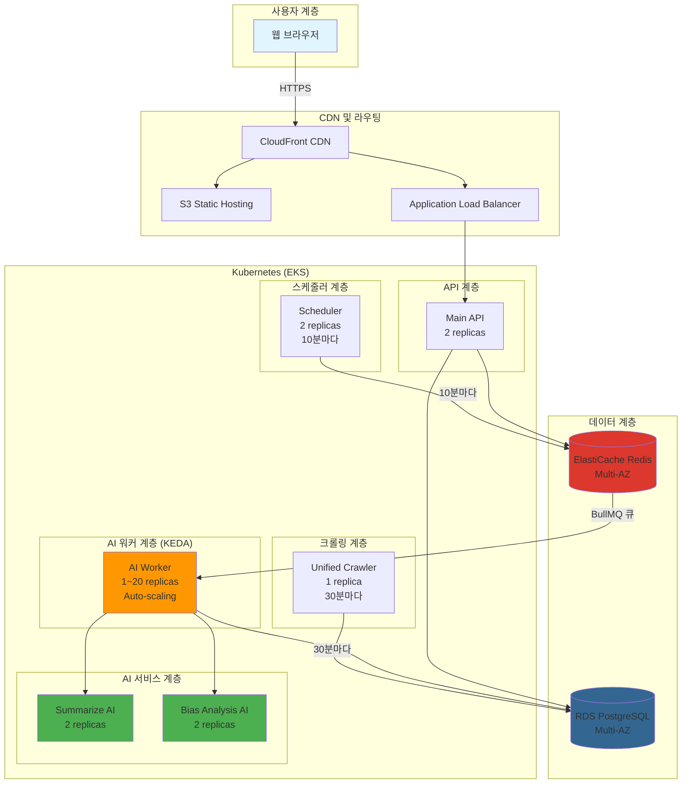
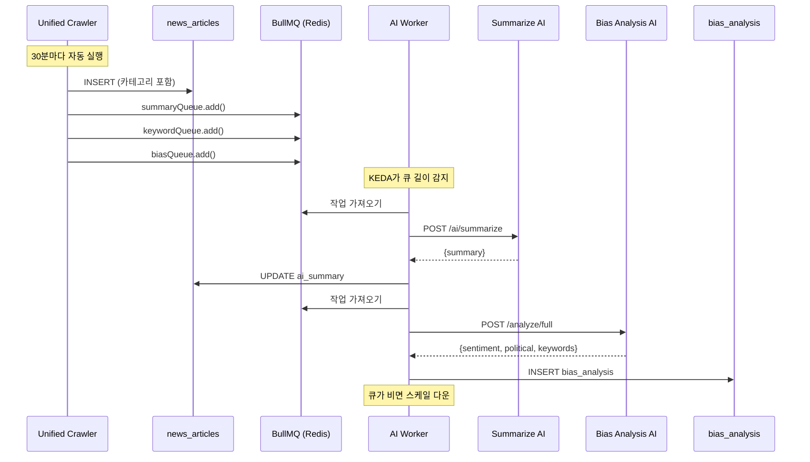
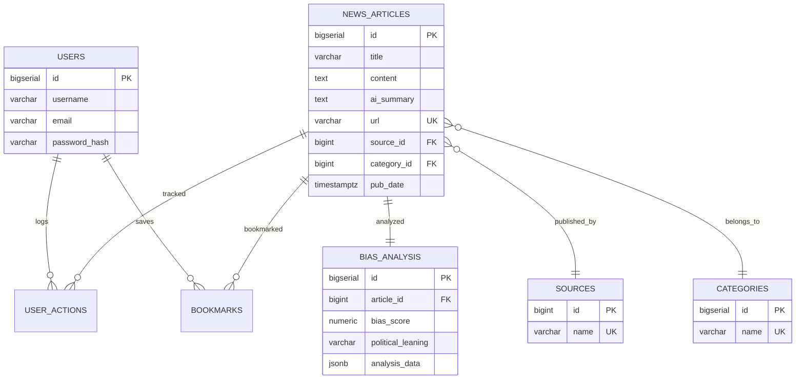
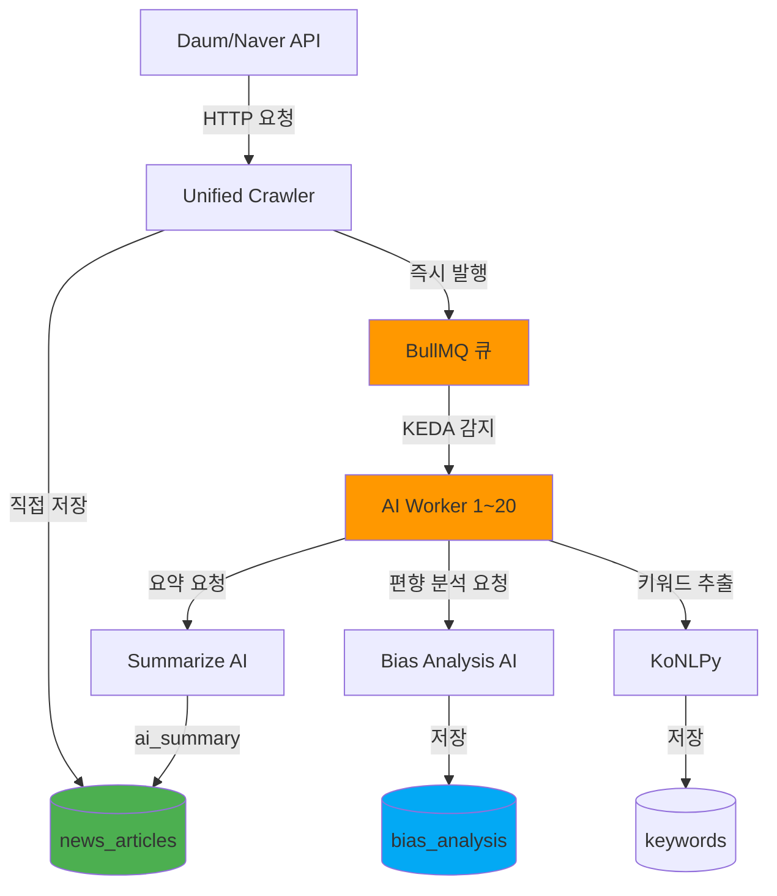
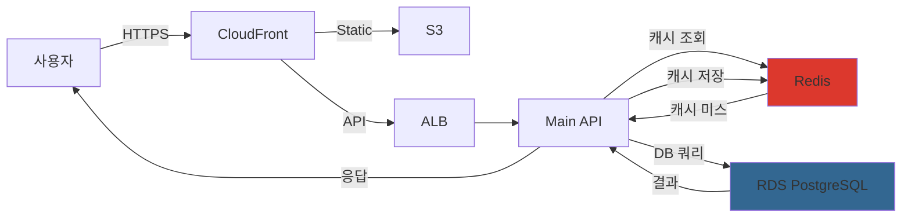

# FANS 시스템 아키텍처

**Financial & Analytics News Service**
**작성일**: 2025-11-05
**버전**: 3.0 (KEDA + BullMQ Architecture)

---

## 목차

1. [전체 시스템 개요](#전체-시스템-개요)
2. [아키텍처 변경 히스토리](#아키텍처-변경-히스토리)
3. [기술 스택](#기술-스택)
4. [마이크로서비스 구성](#마이크로서비스-구성)
5. [크롤링 및 AI 파이프라인](#크롤링-및-ai-파이프라인)
6. [KEDA 오토스케일링](#keda-오토스케일링)
7. [데이터베이스 설계](#데이터베이스-설계)
8. [데이터 흐름도](#데이터-흐름도)
9. [배포 아키텍처](#배포-아키텍처)
10. [성능 및 비용 최적화](#성능-및-비용-최적화)

---

## 전체 시스템 개요

### 시스템 구성도



---

## 아키텍처 변경 히스토리

### v1.0 - Spark/Kafka/Airflow 아키텍처 (2025-09 이전)

**특징**:
- Apache Spark (대용량 데이터 처리)
- Apache Kafka (메시지 큐)
- Apache Airflow (워크플로우 오케스트레이션)

**문제점**:
- 메모리 사용량: 16GB+
- 복잡한 인프라 관리
- 높은 운영 비용
- 오버엔지니어링 (실제 데이터량 대비)

---

### v2.0 - 경량화 아키텍처 (2025-10-16)

**변경 사항**:
```
❌ Spark, Kafka, Airflow 제거
✅ Node.js + Python 단순화
✅ node-cron 스케줄러
✅ PostgreSQL + Redis만 사용
```

**효과**:
- 메모리 사용량: 4GB (75% 절감)
- 간소화된 인프라
- 비용 효율적

**문제점**:
- 스케줄러가 고정 주기로 실행 (10분)
- AI 처리 부하에 따른 동적 확장 불가
- 야간 백로그 처리 시 리소스 낭비

---

### v3.0 - KEDA + BullMQ 아키텍처 (2025-11-05 현재)

**핵심 변경 사항**:
```
✅ BullMQ (Redis 기반 작업 큐)
✅ KEDA 오토스케일링 (1~20 replicas)
✅ AI Worker 분리 (독립적 확장)
✅ Classification API 제거 (크롤러 내부 로직으로 통합)
✅ raw_news_articles 테이블 제거 (직접 저장)
```

**장점**:
- 큐 길이 기반 동적 확장
- 비용 최적화 (유휴 시 최소 1개)
- 처리 속도 향상 (병렬 처리)
- 복잡성 감소 (중간 단계 제거)

---

## 기술 스택

### 전체 기술 스택 요약

| 계층 | 기술 | 버전 | 용도 |
|------|------|------|------|
| **Frontend** | React | 18.2.0 | 사용자 인터페이스 |
| **Backend** | Node.js + TypeScript | 18+ | RESTful API |
| **크롤러** | Node.js + TypeScript | 18+ | 뉴스 수집 |
| **스케줄러** | Node.js + node-cron | 18+ | 주기적 작업 |
| **AI Worker** | Node.js + BullMQ | 18+ | 큐 기반 AI 처리 |
| **AI 서비스** | Python + FastAPI | 3.10 | 요약/편향 분석 |
| **작업 큐** | BullMQ + Redis | 4.x | 비동기 작업 관리 |
| **오토스케일링** | KEDA | 2.12+ | Kubernetes 이벤트 기반 스케일링 |
| **데이터베이스** | PostgreSQL | 15+ | 메인 데이터베이스 |
| **캐시** | Redis | 7+ | 인메모리 캐싱 |
| **컨테이너** | Docker | 24+ | 애플리케이션 컨테이너화 |
| **오케스트레이션** | Amazon EKS | 1.31 | Kubernetes 관리 |
| **IaC** | Terraform | 1.6+ | 인프라 코드화 |

---

## 마이크로서비스 구성

### 서비스 목록

| # | 서비스명 | 포트 | 언어/프레임워크 | 역할 | 레플리카 (EKS) |
|---|---------|------|----------------|------|----------------|
| 1 | **Main API** | 3000 | Node.js + Express | 핵심 비즈니스 로직 | 2 |
| 2 | **Unified Crawler** | 4005 | Node.js + TypeScript | 뉴스 수집 (30분마다) | 1 |
| 3 | **Scheduler** | 8080 | Node.js + node-cron | 작업 스케줄링 (10분마다) | 2 |
| 4 | **AI Worker** | - | Node.js + BullMQ | 큐 기반 AI 처리 | 1~20 (KEDA) |
| 5 | **Summarize AI** | 8000 | Python + FastAPI | T5 모델 요약 | 2 |
| 6 | **Bias Analysis AI** | 8002 | Python + FastAPI | KoBERT 편향 분석 | 2 |
| 7 | **PostgreSQL** | 5432 | PostgreSQL 15 | RDS (Multi-AZ) | 1 |
| 8 | **Redis** | 6379 | Redis 7 | ElastiCache (Multi-AZ) | 1 |

**총 Pod 수**: 9~28개 (AI Worker 스케일링에 따라 변동)

---

### 제거된 컴포넌트

#### ❌ Classification API (5000번 포트)

**제거 이유**:
- 크롤러가 이미 카테고리 정보를 가지고 있음 (Daum News API)
- 언론사 매핑 로직은 단순 문자열 매칭으로 충분
- 불필요한 네트워크 호출 제거

**대체 방법**:
```typescript
// Unified Crawler 내부에서 직접 처리
function mapSourceToId(sourceName: string): number {
  const sourceMap = {
    '조선일보': 23,
    '중앙일보': 25,
    '한겨레': 28,
    // ...
  };
  return sourceMap[sourceName] || 449; // 기타
}
```

---

#### ❌ raw_news_articles 테이블

**제거 이유**:
- 중간 단계 없이 바로 news_articles에 저장
- 데이터 중복 제거
- 처리 지연 감소

**변경 전**:
```
Crawler → raw_news_articles (processed=FALSE)
         ↓
Scheduler → Classification API
         ↓
news_articles (최종 저장)
```

**변경 후**:
```
Crawler → news_articles (직접 저장 + 카테고리 포함)
         ↓
BullMQ 큐 즉시 발행
         ↓
AI Worker → AI 서비스들
```

---

### 1. Main API (핵심 API 서버)

**역할**: RESTful API 제공

**기술 스택**:
- Node.js 18 + TypeScript
- Express.js
- TypeORM
- JWT + Passport.js

**주요 API 엔드포인트**:
```
GET  /api/news/feed              # 뉴스 피드
GET  /api/news/:id               # 뉴스 상세
GET  /api/news/search            # 검색
POST /api/auth/login             # 로그인
POST /api/auth/register          # 회원가입
POST /api/bookmarks              # 북마크
POST /api/comments               # 댓글
GET  /health                     # 헬스 체크
```

**레플리카**: 2개 (고가용성)

---

### 2. Unified Crawler (통합 크롤러)

**역할**: 외부 뉴스 소스에서 데이터 수집 및 즉시 저장

**기술 스택**:
- Node.js 18 + TypeScript
- Axios (HTTP 요청)
- Cheerio (HTML 파싱)
- BullMQ (큐 발행)

**크롤링 주기**: 30분마다 자동 실행

**크롤링 소스**:
1. **Daum News**:
   - URL: `https://news.daum.net`
   - 카테고리: 8개 (정치, 경제, 사회, 생활/문화, 세계, IT/과학, 스포츠, 연예)
   - 방식: JSON API

2. **Naver News**:
   - URL: `https://openapi.naver.com/v1/search/news.json`
   - 용도: 검색 보조

**처리 흐름**:
```typescript
// 1. 뉴스 크롤링
const articles = await crawlDaumNews(category);

// 2. news_articles 직접 저장
const newsId = await saveToDatabase({
  title: article.title,
  content: article.content,
  source_id: mapSourceToId(article.source),
  category_id: mapCategoryToId(category),
  pub_date: article.pubDate,
});

// 3. BullMQ 큐 즉시 발행
await summaryQueue.add('summarize', { newsId });
await keywordQueue.add('extract', { newsId });
await biasQueue.add('analyze', { newsId });
```

**레플리카**: 1개

---

### 3. Scheduler (작업 스케줄러)

**역할**: 주기적 작업 자동화

**기술 스택**:
- Node.js 18 + TypeScript
- node-cron
- pg (PostgreSQL 클라이언트)

**스케줄**: 10분마다 (`*/10 * * * *`)

**주요 작업**:
```typescript
cron.schedule('*/10 * * * *', async () => {
  // 1. 요약 없는 기사 조회
  const articlesWithoutSummary = await getArticlesWithoutSummary();

  // 2. BullMQ 큐에 작업 추가
  for (const article of articlesWithoutSummary) {
    await summaryQueue.add('summarize', { newsId: article.id });
    await keywordQueue.add('extract', { newsId: article.id });
    await biasQueue.add('analyze', { newsId: article.id });
  }

  console.log(`✅ ${articlesWithoutSummary.length}개 작업 큐에 추가됨`);
});
```

**레플리카**: 2개 (고가용성, Anti-Affinity로 AZ 분산)

---

### 4. AI Worker (큐 처리 워커)

**역할**: BullMQ 큐에서 작업을 가져와 AI 서비스 호출

**기술 스택**:
- Node.js 18 + TypeScript
- BullMQ (작업 큐)
- Redis (큐 백엔드)

**처리 흐름**:
```typescript
// AI Summary Worker
summaryWorker.process('summarize', async (job) => {
  const { newsId } = job.data;

  // 1. DB에서 기사 조회
  const article = await getArticle(newsId);

  // 2. AI 서비스 호출
  const response = await axios.post('http://summarize-ai:8000/ai/summarize', {
    text: article.content,
    max_length: 100,
  });

  // 3. DB 업데이트
  await updateArticleSummary(newsId, response.data.summary);

  return { newsId, summary: response.data.summary };
});

// AI Keyword Worker
keywordWorker.process('extract', async (job) => {
  // 키워드 추출 로직
});

// AI Bias Worker
biasWorker.process('analyze', async (job) => {
  // 편향성 분석 로직
});
```

**레플리카**: 1~20개 (KEDA 오토스케일링)

**동시 처리 수**:
- WORKER_CONCURRENCY: 5
- SUMMARY_CONCURRENCY: 2

---

### 5. Summarize AI (요약 AI)

**역할**: T5 모델 기반 뉴스 요약

**기술 스택**:
- Python 3.10
- FastAPI
- Transformers (Hugging Face)
- PyTorch

**모델**: `eenzeenee/t5-base-korean-summarization`

**API 엔드포인트**:
```
POST /ai/summarize
  Body: {
    "text": "원본 기사 내용",
    "max_length": 100
  }

  Response: {
    "summary": "AI 생성 요약 (3문장)",
    "length": 85
  }
```

**처리 시간**: 평균 3초/기사

**레플리카**: 2개

---

### 6. Bias Analysis AI (편향성 분석 AI)

**역할**: KoBERT 기반 감성 및 정치 성향 분석

**기술 스택**:
- Python 3.10
- FastAPI
- Transformers (KoBERT)
- KoNLPy (Okt)

**API 엔드포인트**:
```
POST /analyze/full
  Body: {
    "title": "기사 제목",
    "content": "기사 본문"
  }

  Response: {
    "sentiment": {
      "sentiment": "negative",
      "confidence": 0.85,
      "score": -0.65
    },
    "political": {
      "bias_score": 0.72,
      "stance": "left-leaning"
    },
    "keywords": [
      {"word": "경제", "score": 0.95}
    ]
  }
```

**처리 시간**: 평균 2초/기사

**레플리카**: 2개

---

## 크롤링 및 AI 파이프라인

### 전체 파이프라인 흐름 (v3.0)



---

### 처리 단계별 상세

#### 1단계: 크롤링 및 즉시 저장 (30분마다)

```typescript
// backend/crawler/unified-crawler/src/crawler.ts

async function crawlAndSave() {
  const categories = ['정치', '경제', '사회', '생활/문화', '세계', 'IT/과학'];

  for (const category of categories) {
    const articles = await crawlDaumNews(category);

    for (const article of articles) {
      // 1. news_articles 직접 저장
      const newsId = await pool.query(`
        INSERT INTO news_articles (
          title, content, url, image_url,
          source_id, category_id, journalist, pub_date
        )
        VALUES ($1, $2, $3, $4, $5, $6, $7, $8)
        ON CONFLICT (url) DO NOTHING
        RETURNING id
      `, [
        article.title,
        article.content,
        article.url,
        article.image_url,
        mapSourceToId(article.source),
        mapCategoryToId(category),
        article.journalist,
        article.pubDate
      ]);

      if (newsId.rows.length > 0) {
        const id = newsId.rows[0].id;

        // 2. BullMQ 큐에 즉시 추가
        await summaryQueue.add('summarize', { newsId: id });
        await keywordQueue.add('extract', { newsId: id });
        await biasQueue.add('analyze', { newsId: id });
      }
    }
  }
}
```

---

#### 2단계: KEDA 오토스케일링 (자동)

```yaml
# KEDA가 Redis 큐 길이를 모니터링
- type: redis
  metadata:
    listName: bull:ai-summary:wait
    listLength: "5"  # 대기 작업 5개당 Pod 1개 추가
```

**스케일링 동작**:
- 큐 길이 0~4: 1개 Pod (최소)
- 큐 길이 5~9: 2개 Pod
- 큐 길이 10~14: 3개 Pod
- ...
- 큐 길이 95~99: 20개 Pod (최대)

---

#### 3단계: AI Worker 처리 (동적)

```typescript
// backend/ai-worker/src/workers/summaryWorker.ts

const summaryWorker = new Worker('ai-summary', async (job) => {
  const { newsId } = job.data;

  try {
    // 1. 기사 조회
    const result = await pool.query(`
      SELECT id, title, content
      FROM news_articles
      WHERE id = $1 AND ai_summary IS NULL
    `, [newsId]);

    if (result.rows.length === 0) {
      return { skipped: true, reason: 'already_processed' };
    }

    const article = result.rows[0];

    // 2. AI 요약 서비스 호출
    const response = await axios.post(
      `${process.env.SUMMARIZE_AI_URL}/ai/summarize`,
      {
        text: article.content,
        max_length: 100,
      },
      { timeout: 30000 }
    );

    // 3. DB 업데이트
    await pool.query(`
      UPDATE news_articles
      SET ai_summary = $1, updated_at = NOW()
      WHERE id = $2
    `, [response.data.summary, newsId]);

    return {
      newsId,
      summary: response.data.summary,
      processingTime: response.data.processingTime,
    };

  } catch (error) {
    console.error(`❌ 요약 실패 (newsId: ${newsId}):`, error.message);
    throw error; // BullMQ가 자동 재시도
  }
}, {
  connection: redisConnection,
  concurrency: parseInt(process.env.SUMMARY_CONCURRENCY || '2'),
  limiter: {
    max: 10,
    duration: 1000, // 초당 10개 제한
  },
});
```

---

### 처리 성능 지표

| 단계 | 소요 시간 | 비고 |
|------|---------|------|
| **크롤링** | ~2초/기사 | HTTP 요청 + HTML 파싱 |
| **DB 저장** | ~0.1초/기사 | INSERT + 인덱스 업데이트 |
| **큐 발행** | ~0.01초/작업 | Redis LPUSH |
| **요약** | ~3초/기사 | T5 GPU 추론 |
| **편향 분석** | ~2초/기사 | KoBERT 추론 |
| **키워드 추출** | ~0.5초/기사 | KoNLPy 형태소 분석 |
| **총 처리 시간** | **~5.5초/기사** | 병렬 처리로 단축 |

---

### 일일 처리 통계

| 항목 | 값 | 비고 |
|------|-----|------|
| **크롤링 횟수** | 48회/일 | 30분마다 |
| **회당 수집량** | 40개 | 카테고리당 5개 × 8 |
| **일일 크롤링 총량** | 1,920개 | 중복 포함 |
| **중복 제거 후** | ~800개 | URL 중복 제거 |
| **AI 처리 큐 발행** | 즉시 | 크롤링 직후 |
| **일일 AI 처리량** | ~800개 | Worker 병렬 처리 |

---

## KEDA 오토스케일링

### KEDA ScaledObject 설정

```yaml
# environments/eks/manifests/16-keda-scaledobject.yaml

apiVersion: keda.sh/v1alpha1
kind: ScaledObject
metadata:
  name: ai-worker-scaler
  namespace: fans
spec:
  scaleTargetRef:
    name: ai-worker  # AI Worker Deployment

  # 스케일링 범위
  minReplicaCount: 1   # 최소 1개 (비용 절감)
  maxReplicaCount: 20  # 최대 20개

  # 스케일 다운 정책
  cooldownPeriod: 300  # 5분 동안 대기 후 스케일 다운
  pollingInterval: 30  # 30초마다 메트릭 확인

  # Redis 큐 기반 트리거
  triggers:
  # AI Summary 큐
  - type: redis
    metadata:
      address: redis.fans.svc.cluster.local:6379
      listName: bull:ai-summary:wait  # BullMQ 큐 이름
      listLength: "5"  # 대기 작업 5개당 Pod 1개 추가
      activationListLength: "1"  # 작업 1개 이상이면 활성화

  # AI Keyword 큐
  - type: redis
    metadata:
      address: redis.fans.svc.cluster.local:6379
      listName: bull:ai-keyword:wait
      listLength: "10"  # 키워드 추출은 빠르므로 10개당 1개
      activationListLength: "5"

  # AI Bias 큐
  - type: redis
    metadata:
      address: redis.fans.svc.cluster.local:6379
      listName: bull:ai-bias:wait
      listLength: "10"  # 편향 분석도 빠르므로 10개당 1개
      activationListLength: "5"
```

---

### KEDA 스케일링 동작 예시

#### 시나리오 1: 크롤링 직후 (대량 유입)

```
시간    큐 길이    Pod 수    상태
--------------------------------------
00:00   0개       1개       대기 중
00:30   240개     20개      ⬆️ 스케일 업 (최대)
00:35   180개     20개      처리 중
00:40   120개     20개      처리 중
00:45   60개      12개      ⬇️ 스케일 다운
00:50   20개      4개       ⬇️ 스케일 다운
00:55   5개       1개       ⬇️ 스케일 다운
01:00   0개       1개       대기 중
```

---

#### 시나리오 2: 야간 백로그 처리

```
시간    큐 길이    Pod 수    상태
--------------------------------------
02:00   1000개    20개      ⬆️ 배치 시작
02:10   900개     20개      처리 중
02:20   800개     20개      처리 중
...
03:50   50개      10개      ⬇️ 스케일 다운
04:00   0개       1개       완료
```

---

### KEDA 비용 효과

| 시간대 | 기존 (고정 10개) | KEDA (동적) | 절감률 |
|--------|-----------------|-------------|--------|
| **피크 타임** (크롤링 직후 30분) | 10개 | 20개 | -100% (성능 향상) |
| **일반 시간** (대부분) | 10개 | 1~3개 | 70~90% |
| **야간** (00:00~06:00) | 10개 | 1개 | 90% |
| **월 평균** | 10개 | ~5개 | **50%** |

**예상 월 비용 절감**: $150 → $75 (50% 절감)

---

## 데이터베이스 설계

### 주요 테이블 구조

#### 1. news_articles (뉴스 기사)

```sql
CREATE TABLE news_articles (
    id BIGSERIAL PRIMARY KEY,
    title VARCHAR(500) NOT NULL,
    content TEXT,
    ai_summary TEXT,                        -- AI 생성 요약
    url VARCHAR(1000) UNIQUE,
    image_url VARCHAR(1000),
    source_id BIGINT REFERENCES sources(id),
    category_id BIGINT REFERENCES categories(id),
    journalist VARCHAR(100),
    pub_date TIMESTAMPTZ,
    created_at TIMESTAMPTZ DEFAULT NOW(),
    updated_at TIMESTAMPTZ DEFAULT NOW(),
    search_vector tsvector                 -- 전문 검색용
);

-- 인덱스
CREATE INDEX idx_news_source_id ON news_articles(source_id);
CREATE INDEX idx_news_category_id ON news_articles(category_id);
CREATE INDEX idx_news_pub_date ON news_articles(pub_date DESC);
CREATE INDEX idx_news_search_vector ON news_articles USING GIN(search_vector);
```

---

#### 2. sources (언론사 마스터)

```sql
CREATE TABLE sources (
    id BIGINT PRIMARY KEY,
    name VARCHAR(100) NOT NULL UNIQUE
);

-- 초기 데이터
INSERT INTO sources (id, name) VALUES
(1, '연합뉴스'),
(20, '동아일보'),
(23, '조선일보'),
(25, '중앙일보'),
(28, '한겨레'),
(32, '경향신문'),
(55, '한국일보'),
(56, '매일경제'),
(214, '한국경제'),
(421, '머니투데이'),
(437, 'YTN'),
(448, 'JTBC'),
(449, '기타');
```

---

#### 3. categories (카테고리 마스터)

```sql
CREATE TABLE categories (
    id BIGSERIAL PRIMARY KEY,
    name VARCHAR(50) NOT NULL UNIQUE
);

-- 초기 데이터
INSERT INTO categories (name) VALUES
('정치'), ('경제'), ('사회'), ('생활/문화'),
('세계'), ('IT/과학'), ('스포츠'), ('연예');
```

---

#### 4. bias_analysis (편향성 분석)

```sql
CREATE TABLE bias_analysis (
    id BIGSERIAL PRIMARY KEY,
    article_id BIGINT REFERENCES news_articles(id),
    bias_score NUMERIC(3,2),                -- -1.00 ~ +1.00
    political_leaning VARCHAR(50),          -- 'left-leaning', 'center', 'right-leaning'
    confidence NUMERIC(3,2),                -- 0.00 ~ 1.00
    analysis_data JSONB,                    -- 전체 분석 데이터
    created_at TIMESTAMPTZ DEFAULT NOW()
);

-- 인덱스
CREATE INDEX idx_bias_article ON bias_analysis(article_id);
CREATE INDEX idx_bias_data ON bias_analysis USING GIN(analysis_data);
```

---

#### 5. user_actions (사용자 행동 로그)

```sql
CREATE TABLE user_actions (
    id BIGSERIAL PRIMARY KEY,
    user_id BIGINT REFERENCES users(id),
    article_id BIGINT REFERENCES news_articles(id),
    action_type VARCHAR(20) CHECK (action_type IN ('VIEW', 'LIKE', 'DISLIKE', 'BOOKMARK')),
    reading_duration INTEGER,               -- 초
    reading_percentage INTEGER,
    created_at TIMESTAMPTZ DEFAULT NOW(),

    CONSTRAINT uk_user_article_action UNIQUE (user_id, article_id, action_type)
);

-- 인덱스
CREATE INDEX idx_user_actions_user_id ON user_actions(user_id);
CREATE INDEX idx_user_actions_article_id ON user_actions(article_id);
```

---

### ERD (Entity Relationship Diagram)



---

## 데이터 흐름도

### 크롤링 → AI → 저장 흐름 (v3.0)



---

### 사용자 요청 흐름



---

## 배포 아키텍처

### AWS EKS 프로덕션 환경

```
                        ┌──────────────────┐
                        │   Route 53       │
                        │   fans.ai.kr     │
                        └────────┬─────────┘
                                 │
                        ┌────────▼─────────┐
                        │   CloudFront     │
                        │   CDN + WAF      │
                        └────────┬─────────┘
                                 │
                    ┌────────────┴────────────┐
                    │                         │
            ┌───────▼────────┐       ┌───────▼────────┐
            │      S3        │       │      ALB       │
            │  (Static Web)  │       │  (API Gateway) │
            └────────────────┘       └───────┬────────┘
                                             │
                    ┌────────────────────────┼────────────────────────┐
                    │                        │                        │
            ┌───────▼────────┐      ┌────────▼────────┐     ┌────────▼────────┐
            │  EKS Cluster   │      │  RDS PostgreSQL │     │  ElastiCache    │
            │  (K8s v1.31)   │      │   (Multi-AZ)    │     │     Redis       │
            │                │      │                 │     │   (Multi-AZ)    │
            │  9~28 Pods     │      └─────────────────┘     └─────────────────┘
            └────────────────┘
                    │
        ┌───────────┼───────────┐
        │           │           │
   ┌────▼───┐  ┌───▼────┐  ┌───▼────┐
   │Main API│  │Crawler │  │Scheduler│
   │2 pods  │  │1 pod   │  │2 pods   │
   └────────┘  └────────┘  └─────────┘
                    │
            ┌───────┴───────┐
            │               │
       ┌────▼────┐     ┌────▼────┐
       │AI Worker│     │AI Svcs  │
       │1~20 pods│     │4 pods   │
       │(KEDA)   │     │         │
       └─────────┘     └─────────┘
```

---

### CronJob 스케줄

#### 1. batch-summary-backlog

```yaml
# 매일 새벽 2시 실행 (한국 시간 기준)
schedule: "0 17 * * *"  # UTC 17시 = KST 02시
```

**역할**: 과거 기사 중 요약되지 않은 기사 1000개 배치 처리

**처리 흐름**:
```typescript
// 1. 요약 없는 기사 조회
const articles = await pool.query(`
  SELECT id FROM news_articles
  WHERE ai_summary IS NULL
  LIMIT 1000
`);

// 2. BullMQ 큐에 추가
for (const article of articles.rows) {
  await summaryQueue.add('summarize', { newsId: article.id });
}

// 3. KEDA가 자동으로 AI Worker 스케일 업
```

---

#### 2. db-backup-to-school (비활성화)

```yaml
# 매일 새벽 2시 실행 (한국 시간 기준)
schedule: "0 17 * * *"  # UTC 17시 = KST 02시

# 환경 변수로 비활성화
env:
  - name: BACKUP_DB_ENABLED
    value: "false"
```

**역할**: 학원 서버로 DB 백업 (현재 비활성화)

---

## 성능 및 비용 최적화

### Redis 캐싱 전략

```typescript
// backend/api/src/services/newsService.ts

export async function getNewsFeed(topics: string[], limit: number) {
  // 1. 캐시 키 생성
  const cacheKey = `news:feed:${topics.join(',')}:${limit}`;

  // 2. 캐시 조회
  const cached = await redis.get(cacheKey);
  if (cached) {
    console.log('Cache HIT:', cacheKey);
    return JSON.parse(cached);
  }

  // 3. DB 쿼리
  const result = await newsRepository.find({
    where: { category: In(topics) },
    order: { pub_date: 'DESC' },
    take: limit,
  });

  // 4. 캐시 저장 (TTL 5분)
  await redis.setex(cacheKey, 300, JSON.stringify(result));

  return result;
}
```

**캐시 히트율**: 70%+
**응답 시간**: <100ms (캐시 히트 시)

---

### 비용 구성 (월 예상)

| 컴포넌트 | 구성 | 월 비용 (기존) | 월 비용 (KEDA) | 절감 |
|---------|------|---------------|---------------|------|
| **EKS Cluster** | 클러스터 비용 | $70 | $70 | - |
| **EC2 노드** | t3.large × 2 (고정) | $120 | $120 | - |
| **AI Worker 노드** | t3.medium × 10 (고정) | $300 | $150 (평균 5개) | **$150** |
| **RDS PostgreSQL** | db.t3.small Multi-AZ | $40 | $40 | - |
| **ElastiCache Redis** | cache.t3.small Multi-AZ | $30 | $30 | - |
| **ALB** | Application Load Balancer | $25 | $25 | - |
| **NAT Gateway** | 2 AZ | $70 | $70 | - |
| **CloudFront** | CDN + 데이터 전송 | $20 | $20 | - |
| **총 월 비용** | | **$675** | **$525** | **$150 (22%)** |

---

## 관련 문서

- [01_프로젝트_개요_및_구성도.md](01_프로젝트_개요_및_구성도.md)
- [03_크롤링_및_AI_분석_흐름.md](03_크롤링_및_AI_분석_흐름.md)
- [04_배포_전략_가이드.md](04_배포_전략_가이드.md)
- [05_성능_최적화_가이드.md](05_성능_최적화_가이드.md)
- [07_비용_최적화_및_스케일링_가이드.md](07_비용_최적화_및_스케일링_가이드.md)

---

**작성일**: 2025-11-05
**버전**: 3.0 (KEDA + BullMQ Architecture)
**다음 문서**: [03_크롤링_및_AI_분석_흐름.md](03_크롤링_및_AI_분석_흐름.md)
