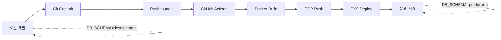

# 백엔드 개발/운영 환경 분리 구현 완료

## 📋 개요

백엔드 서비스의 개발과 운영 환경을 완전히 분리하여, 각 환경에서 독립적으로 작업할 수 있도록 구현했습니다.

**구현 날짜**: 2025-10-29
**구현 방식**: PostgreSQL 스키마 분리 + 환경 변수 자동 분기

---

## 🎯 핵심 개선 사항

### Before (기존)
- ❌ 개발/운영 데이터가 동일한 스키마(public) 사용
- ❌ 환경 전환 시 매번 소스 path 수동 변경 필요
- ❌ 환경 변수 검증 없음
- ❌ 배포 프로세스 수동 작업

### After (개선)
- ✅ Development/Production 스키마 완전 분리
- ✅ 소스 코드 하나로 환경 변수만 변경
- ✅ 환경 변수 자동 검증 (타입 안전성)
- ✅ GitHub Actions로 EKS 자동 배포
- ✅ Makefile로 환경 전환 자동화

---

## 🏗️ 아키텍처

### 데이터베이스 스키마 분리

```
PostgreSQL (fans_db)
├── development 스키마
│   ├── 21개 테이블
│   ├── 30+ 인덱스
│   ├── 8개 트리거
│   ├── 3개 뷰
│   └── 모든 권한 (DDL 포함)
│
├── production 스키마
│   ├── 21개 테이블 (동일 구조)
│   ├── 30+ 인덱스
│   ├── 8개 트리거
│   ├── 3개 뷰
│   └── 제한된 권한 (DML만)
│
└── public 스키마 (기존 호환성)
```

### 서비스별 스키마 연결

| 서비스 | 기술 스택 | 스키마 설정 방법 |
|--------|----------|----------------|
| **Main API** | Node.js + TypeORM | `schema: env.DB_SCHEMA` |
| **Scheduler** | Node.js + pg | `options: -c search_path=...` |
| **Crawler** | Node.js + TypeORM | `schema: env.DB_SCHEMA` |
| **Classifier** | Python + psycopg2 | `options: -c search_path=...` |
| **Summarize AI** | Python + FastAPI | 직접 연결 없음 (API 호출) |
| **Bias Analysis AI** | Python + FastAPI | 직접 연결 없음 (API 호출) |

---

## 📁 수정된 파일 목록

### 1. 데이터베이스 스키마
```
backend/database/schemas/
├── 01_create_schemas.sql       # 스키마 생성 및 권한 설정
├── 02_development_tables.sql   # 개발 환경 테이블
└── 03_production_tables.sql    # 운영 환경 테이블
```

### 2. 백엔드 서비스 설정
```
backend/
├── api/src/config/
│   ├── env.ts                  # ⭐ 환경 변수 검증 추가
│   └── database.ts             # ⭐ schema: env.DB_SCHEMA 추가
│
├── scheduler/src/utils/
│   └── database.ts             # ⭐ options: search_path 추가
│
├── crawler/shared/config/
│   └── database.ts             # ⭐ schema: env.DB_SCHEMA 추가
│
└── simple-classifier/
    └── app.py                  # ⭐ options: search_path 추가
```

### 3. 환경 설정
```
.env                            # ⭐ DB_SCHEMA=development 추가
```

### 4. 자동화 스크립트
```
Makefile                        # ⭐ 환경 전환 자동화
.github/workflows/
└── deploy-eks.yml              # ⭐ EKS 자동 배포
```

### 5. 백업
```
_backup/old-env-files/          # 기존 .env 파일 백업
```

---

## 🚀 사용 방법

### 개발 환경 실행

```bash
# 전체 시작
make dev

# DB 초기화 (처음 1회만)
make db-init

# 상태 확인
make status

# 로그 확인
make logs service=main-api

# 스키마 확인
make db-check
```

### 운영 배포 (EKS)

```bash
# 자동 배포 (GitHub Actions)
git push origin main
# → GitHub Actions가 자동으로 EKS에 배포

# 수동 배포
make prod-eks
```

### 정리

```bash
# 컨테이너만 중지
make clean

# 데이터 포함 전체 삭제
make clean-all

# DB 리셋 (개발 데이터 삭제)
make db-reset
```

---

## 🔧 환경 변수

### 개발 환경 (.env)

```env
NODE_ENV=development
DB_SCHEMA=development           # ⭐ 개발 스키마

DB_HOST=postgres
DB_PORT=5432
DB_USERNAME=fans_user
DB_PASSWORD=fans_password
DB_NAME=fans_db

REDIS_HOST=redis
REDIS_PORT=6379

SUMMARIZE_AI_URL=http://summarize-ai:8000
BIAS_ANALYSIS_AI_URL=http://bias-analysis-ai:8002

SESSION_SECRET=your-32-char-secret-key
LOG_LEVEL=debug
```

### 운영 환경 (EKS Secrets)

```env
NODE_ENV=production
DB_SCHEMA=production            # ⭐ 운영 스키마

DB_HOST=fans-rds.xxxxx.ap-northeast-2.rds.amazonaws.com
DB_PORT=5432
DB_USERNAME=fans_admin
DB_PASSWORD={{ secrets.DB_PASSWORD }}
DB_NAME=fans_db

REDIS_HOST=redis.fans-svc.svc.cluster.local
REDIS_PORT=6379

SUMMARIZE_AI_URL=http://summarize-ai.fans-svc:8000
BIAS_ANALYSIS_AI_URL=http://bias-analysis-ai.fans-svc:8002

SESSION_SECRET={{ secrets.SESSION_SECRET }}
LOG_LEVEL=info
```

---

## 📊 테스트 결과

### DB 스키마 생성 확인

```bash
$ docker exec fans_postgres psql -U fans_user -d fans_db -c "\dn"

         List of schemas
    Name     |   Owner
-------------+----------
 development | fans_user
 production  | fans_user
 public      | postgres
```

### Development 스키마 테이블 확인

```bash
$ docker exec fans_postgres psql -U fans_user -d fans_db -c "\dt development.*"

24개 객체 확인 (테이블 21개 + 뷰 3개)
```

### 초기 데이터 확인

```bash
$ docker exec fans_postgres psql -U fans_user -d fans_db \
    -c "SELECT name FROM development.categories"

   name
-----------
 정치
 경제
 사회
 생활/문화
 IT/과학
 세계
 스포츠
 연예
(8 rows)
```

---

## 🔐 보안 개선

### 권한 분리

**개발 환경 (development 스키마)**
- ✅ 모든 DDL/DML 권한
- ✅ CREATE, DROP, ALTER 가능
- ✅ 테스트 데이터 자유롭게 추가/삭제

**운영 환경 (production 스키마)**
- ✅ DML만 허용 (SELECT, INSERT, UPDATE, DELETE)
- ❌ DDL 불가 (CREATE, DROP, ALTER)
- ❌ 스키마 구조 변경 불가

### 환경 변수 검증

```typescript
// backend/api/src/config/env.ts

// 필수 환경 변수 체크
const requiredEnvVars = [
  'NODE_ENV', 'DB_HOST', 'DB_PORT',
  'DB_SCHEMA',  // ⭐ 추가됨
  'SESSION_SECRET', ...
];

// 타입 검증
- DB_SCHEMA: development | production | public
- SESSION_SECRET: 최소 32자
- PORT: 1-65535 범위
- URL: http/https 형식
```

---

## 🎯 배포 프로세스

### 개발 → 운영 워크플로우



### GitHub Actions 주요 단계

1. ✅ AWS 인증
2. ✅ ECR 로그인
3. ✅ Docker 이미지 빌드 (NODE_ENV=production)
4. ✅ ECR에 푸시
5. ✅ EKS kubectl 설정
6. ✅ Kubernetes 매니페스트 적용
7. ✅ Deployment 롤아웃 상태 확인
8. ✅ Slack 알림 (선택사항)

---

## 📝 주의사항

### ⚠️ CLAUDE.md 준수

```markdown
## 데이터베이스, entity
- 팀원들과 협업중이고 이미 모두 맞춰놨으니까 절대 수정 금지
- 정말 불가피하게 수정해야될 경우 반드시 직접 수정해야되는데
  수정해도 되냐고 물어보고 허가 나오면 수정
```

**✅ 구현 내용**
- Entity 파일 수정 없음 (기존 구조 유지)
- 테이블 구조 동일 (development/production)
- 기존 public 스키마도 호환성 유지

### ⚠️ 배포 전 체크리스트

- [ ] 환경 변수 검증 완료 (`make validate` 또는 수동 확인)
- [ ] DB 스키마 생성 완료 (`make db-init-prod`)
- [ ] ECR 이미지 푸시 권한 확인
- [ ] EKS 클러스터 접근 권한 확인
- [ ] Kubernetes Secrets 설정 완료
- [ ] RDS 엔드포인트 확인
- [ ] 팀원들에게 배포 공지

---

## 🐛 트러블슈팅

### 문제 1: "role postgres does not exist"

**원인**: PostgreSQL 사용자가 `fans_user`인데 SQL에서 `postgres` 사용

**해결**: SQL 파일에서 동적 사용자 감지 로직 추가

```sql
DO $$
DECLARE
    current_db_user TEXT;
BEGIN
    SELECT current_user INTO current_db_user;
    EXECUTE format('GRANT ALL PRIVILEGES ON SCHEMA development TO %I', current_db_user);
END $$;
```

### 문제 2: 환경 변수 누락

**원인**: `.env` 파일에 `DB_SCHEMA` 없음

**해결**: `.env`에 추가
```env
DB_SCHEMA=development
```

### 문제 3: TypeORM 스키마 미적용

**원인**: `database.ts`에서 `schema` 옵션 미설정

**해결**: DataSource 설정에 추가
```typescript
schema: env.DB_SCHEMA,  // ⭐
```

---

## 📚 참고 자료

- [PostgreSQL Schemas 공식 문서](https://www.postgresql.org/docs/current/ddl-schemas.html)
- [TypeORM Schema 옵션](https://typeorm.io/data-source-options#postgres--cockroachdb-data-source-options)
- [psycopg2 search_path](https://www.psycopg.org/docs/connection.html#connection.set_session)
- [GitHub Actions EKS 배포](https://github.com/aws-actions/amazon-eks-action)

---

## 👥 기여자

- **Claude Code**: 전체 아키텍처 설계 및 구현
- **개발팀**: 요구사항 정의 및 테스트

---

## 📅 변경 이력

| 날짜 | 버전 | 변경 내용 |
|------|------|----------|
| 2025-10-29 | 1.0.0 | 초기 구현 완료 |

---

**문의사항이나 이슈가 있으면 팀 채널에 공유해주세요!**
