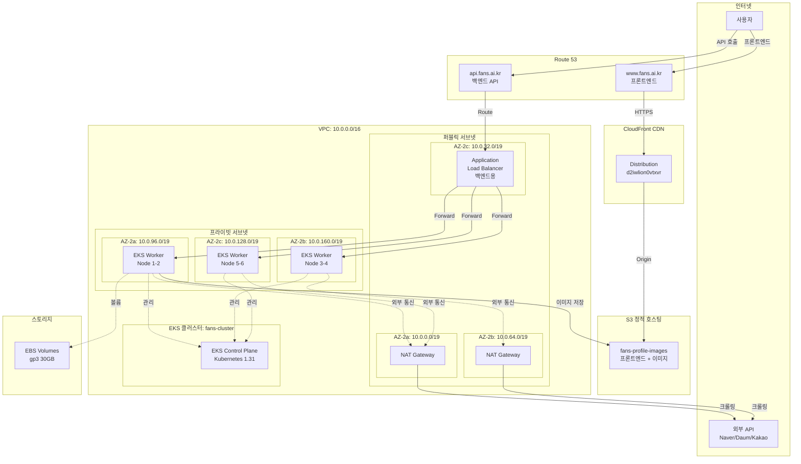
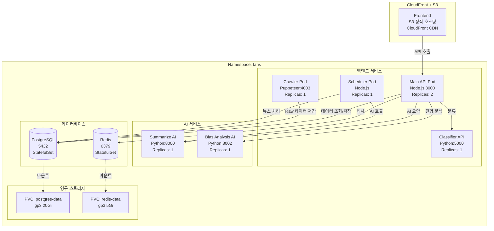
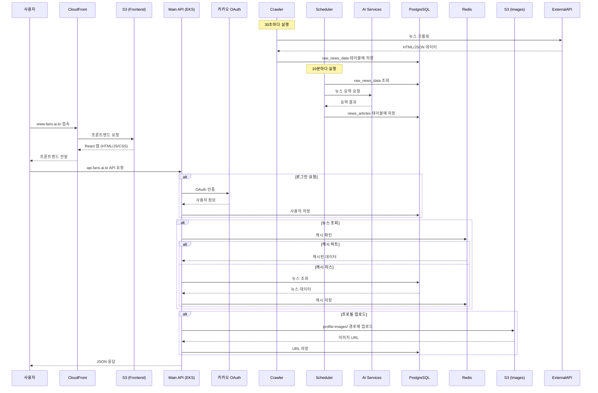
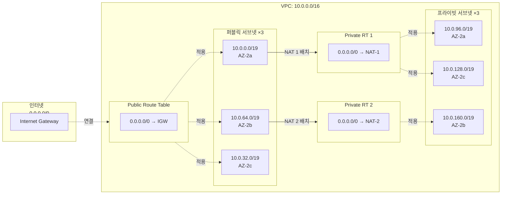
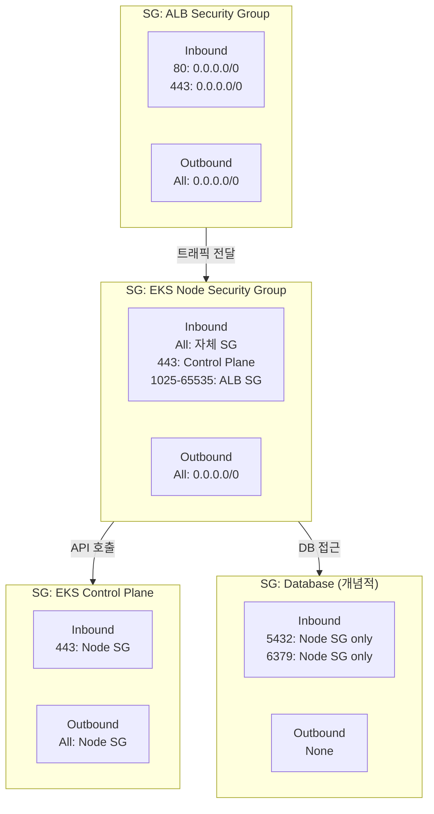
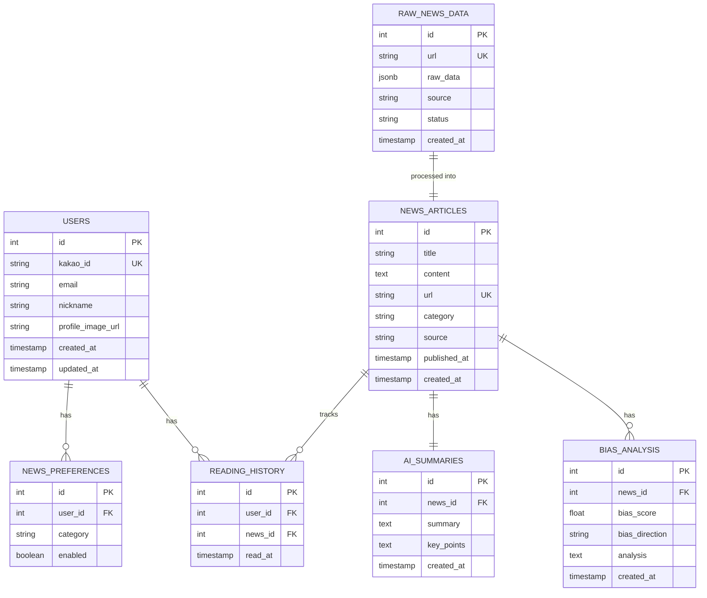
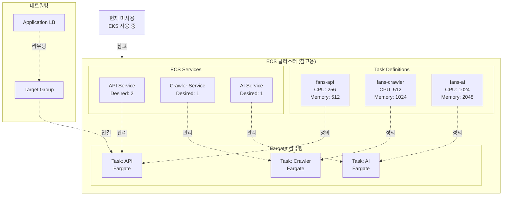
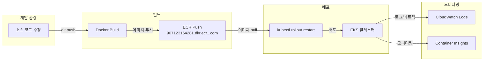

# FANS 프로젝트 인프라 아키텍처

## 1. 전체 아키텍처 (EKS + S3/CloudFront 하이브리드)

## 2. EKS 파드 배포 구성 (프론트엔드 S3로 이동)

## 3. 데이터 흐름도 (S3 + CloudFront 프론트엔드)

## 4. 네트워크 구성

## 5. 보안 그룹 구성

## 6. 데이터베이스 ERD (주요 테이블)

## 7. ECS 아키텍처 (참고용 - 미사용)

## 8. CI/CD 파이프라인

## 주요 구성 요약

### 컴퓨팅
- **EKS 클러스터**: fans-cluster (Kubernetes 1.31)
- **노드 그룹**:
  - Medium (t3.medium × 3)
  - Large (t3.large × 3)
- **총 노드**: 6개 (3개 AZ 분산)

### 네트워킹
- **VPC**: 10.0.0.0/16
- **서브넷**: 퍼블릭 3개 + 프라이빗 3개
- **NAT Gateway**: 2개 (고가용성)
- **Load Balancer**: ALB 1개

### 스토리지
- **EBS**: gp3 볼륨 (PostgreSQL, Redis)
- **S3**: fans-profile-images-907123164281

### 보안
- **IAM 역할**: Node 역할에 S3 접근 정책
- **보안 그룹**: ALB, Node, Control Plane 분리
- **네트워크**: 프라이빗 서브넷에서 노드 실행

### 데이터베이스
- **PostgreSQL**: 5432 (StatefulSet)
- **Redis**: 6379 (캐시)
- **주요 테이블**: users, news_articles, raw_news_data, ai_summaries
