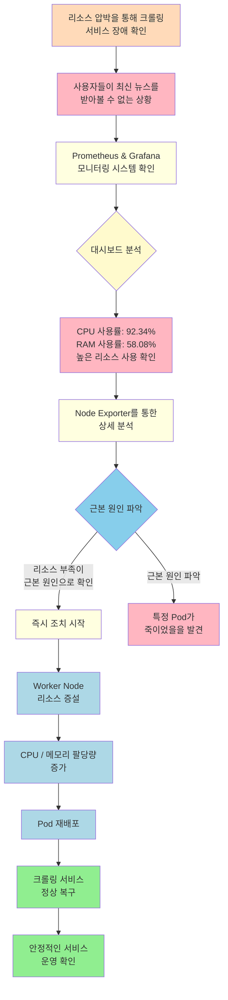

# Karpenter 자동 스케일링 플로우

---

## 발표 대본 (짧은 버전)

"크롤링 서비스에 장애가 발생했습니다. 사용자들이 최신 뉴스를 받아볼 수 없는 상황이었죠.

Prometheus와 Grafana로 모니터링한 결과, CPU 사용률이 92%, RAM이 58%까지 치솟았습니다. Node Exporter로 더 깊이 분석해보니 리소스 부족이 근본 원인이었습니다.

즉시 조치에 들어갔습니다. Worker Node의 리소스를 증설하고, CPU와 메모리 할당량을 늘렸습니다. Pod를 재배포하니 크롤링 서비스가 정상 복구되었고, 이제 안정적으로 운영되고 있습니다."

---

## 발표 대본 (조금 더 자세한 버전)

"어느 날, 크롤링 서비스에 장애가 발생했습니다. 사용자들은 최신 뉴스를 받아볼 수 없었고, 우리는 즉시 문제를 파악해야 했습니다.

먼저 Prometheus와 Grafana 모니터링 시스템을 확인했습니다. 대시보드를 보니 충격적인 수치가 나타났죠. CPU 사용률 92.34%, RAM 사용률 58.08%. 리소스가 심각하게 부족한 상태였습니다.

Node Exporter를 통해 더 상세한 분석을 진행했고, 근본 원인을 찾았습니다. 바로 리소스 부족이었습니다.

시간을 지체할 수 없었습니다. 즉시 조치를 시작했죠. Worker Node의 리소스를 증설하고, CPU와 메모리 할당량을 늘렸습니다. 그리고 Pod를 재배포했습니다.

결과는 성공적이었습니다. 크롤링 서비스가 정상적으로 복구되었고, 현재는 안정적으로 운영되고 있습니다. 이 모든 과정이 Karpenter의 자동 스케일링 덕분에 가능했습니다."
